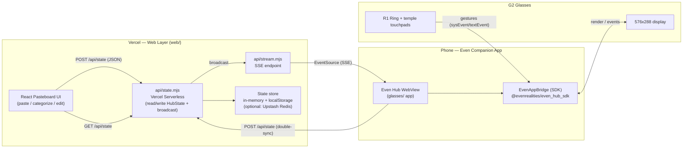

# Architecture — G2 Even Reality Hub

## System Diagram



## Data Flow (paste → glasses)

1. **Paste** — user pastes text into the React pasteboard UI.
2. **Categorize** — `web/src/categorize.ts` heuristically splits content into
   **To-Do / Docs / Notes** (checkbox/task keywords → todo; the rest → docs; quick capture → notes).
3. **Persist + Broadcast** — `api/state.mjs` stores the `HubState` snapshot and pushes a
   `{ type: "state", state }` frame to every connected SSE client.
4. **Stream** — the glasses app (inside the Even Hub WebView) holds an `EventSource` to
   `/api/stream?channel=hub` and re-renders the active section on each `state` frame.
5. **Control** — the R1 ring drives:
   - swipe up/down → scroll content (native text/list scrolling)
   - single press → select / confirm (toggle a To-Do, pick a menu item)
   - double press → system exit dialog (canonical)
   - OS tap-then-long-press → **contextual menu** (section switcher); selection fires `menuItemClickEvent`
6. **Double-sync** — glasses confirmations POST back to `/api/state`; the web UI updates live.

## Key Contracts

### `HubState`

```ts
type SectionId = 'todo' | 'docs' | 'notes';

interface TodoItem { id: string; text: string; done: boolean; }

interface HubState {
  activeSection: SectionId;
  sections: {
    todo: TodoItem[];
    docs: string;
    notes: string;
  };
  updatedAt: number;
}
```

### SSE frames (JSON in `data:`)

| Frame | Payload | When |
|---|---|---|
| `init` | `{ type: 'init', state }` | Sent once on connect |
| `state` | `{ type: 'state', state }` | Sent on every state change |

### Event routing in the glasses app

| Source | Gesture | SDK event |
|---|---|---|
| R1 ring / touchpad | swipe up | `textEvent.eventType = 1` (SCROLL_TOP) |
| R1 ring / touchpad | swipe down | `textEvent.eventType = 2` (SCROLL_BOTTOM) |
| R1 ring / touchpad | single press | `sysEvent.eventType = 0` (CLICK) / `listEvent` |
| R1 ring / touchpad | double press | `sysEvent.eventType = 3` (DOUBLE_CLICK) → system exit dialog |
| OS contextual menu | tap then long press | OS opens the menu; selection arrives as `menuItemClickEvent.itemID` |
| — | foreground enter/exit | `sysEvent.eventType = 4` / `5` |
| — | abnormal / system exit | `sysEvent.eventType = 6` / `7` |

Detect R1 ring specifically via `sysEvent.eventSource === 2` (EventSourceType.ring).

## G2 Display Layout (glasses/)

- Canvas: **576 × 288 px**, 4-bit greyscale (16 shades of green).
- Title bar: `TextContainerProperty` at top (y=0, h=32).
- Content: `TextContainerProperty` (Docs/Notes, native scroll) or `ListContainerProperty`
  (To-Do, native scroll + selection highlight).
- Contextual menu: OS overlay declared via `menuObject` (To-Do / Docs / Notes); the OS opens it on tap-then-long-press.
- Rules respected: ≤12 containers/page, exactly one `isEventCapture: 1`, content char limits,
  `zOrderIndex` stacking.

## Deployment

| Piece | Where | How |
|---|---|---|
| Web | `web/` | `npx vercel --prod` |
| Glasses | `glasses/` | `npm run build` → `npx evenhub pack app.json dist` → QR / portal |
