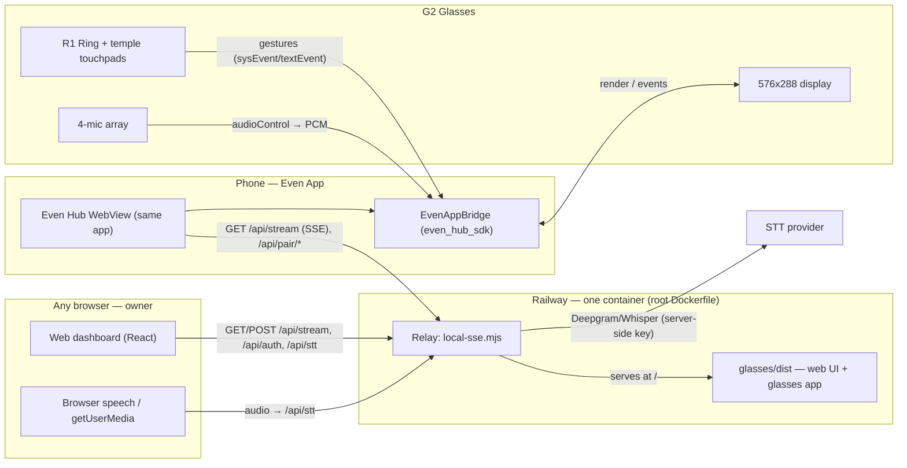

# Architecture — G2 Even Reality Hub

## One unified app + one relay

This is a **single Vite + TypeScript app** (in `glasses/`) that does double duty
from one URL:

- **Any browser** → renders the companion **web dashboard** (`glasses/src/web/`):
  paste box, multi-doc library, to-do, notes, voice-dictation mic buttons, and the
  Devices/approval panel.
- **Inside the Even App (phone)** → the same code also drives the **G2 glasses**
  renderer (`glasses/src/main.ts`) over the `@evenrealities/even_hub_sdk` bridge.

A single zero-dependency Node **relay** (`web/server/local-sse.mjs`) serves the
built app at `/`, plus the live stream and all APIs on the **same origin**. It
deploys as one container via the root `Dockerfile` (Node 22) to Railway.

```
Browser (owner)          Phone Even App (glasses)
   │  GET /  (UI)             │  GET /  (UI + SDK bridge → G2)
   ▼                          ▼
   ┌──────────────────────────────────────────┐
   │  Relay  web/server/local-sse.mjs          │
   │  /            → serve glasses/dist (SPA)  │
   │  /app.json    → Even Hub manifest         │
   │  /api/stream  → SSE (GET) + state (POST)  │
   │  /api/auth/*  → Google verify, /me, logout│
   │  /api/pair/*  → device pairing/approval   │
   │  /api/devices → owner device manager      │
   │  /api/stt(+ws)→ voice transcription proxy │
   │  state/auth persisted to AUTH_FILE/STATE  │
   └──────────────────────────────────────────┘
```

## System diagram



## Data flow (paste → glasses)

1. **Paste / dictate** — text enters via the paste box or a mic button
   (`web/Dictate.tsx` → `dictate.ts`, which routes by target: glasses SDK mic vs
   browser `getUserMedia`/Web Speech).
2. **Categorize** — `categorize.ts` heuristically splits content into **To-Do /
   Docs / Notes**; Docs land in the open document (`activeDocId`).
3. **Persist + broadcast** — the local store (`store.ts`) updates `HubState` and
   POSTs it to `/api/stream`; the relay stores the last snapshot and pushes a
   `{ type: "state", state }` frame to every connected SSE client.
4. **Stream** — each client (browser + every approved Even App device) holds an
   `EventSource` to `/api/stream?channel=hub&token=…` and re-renders on each frame.
5. **Glasses render** — `main.ts` draws the active section; content is byte-clipped
   to the G2 OS cap (**999 UTF-8 bytes** per container) and paginated with
   `@evenrealities/pretext` so it fills the 576×288 screen.
6. **Control** — the R1 ring / touchpad navigate (see events below); confirmations
   update local state and broadcast back to every device.
7. **Durable storage** — docs + the Even App device session are mirrored through
   the SDK host store (`bridge.setLocalStorage`) AND `localStorage` (dual-write),
   so they survive Even App restarts (see `durable-docs.ts`).

## Key contracts

### `HubState` (`glasses/src/types.ts`)

```ts
type SectionId = 'todo' | 'docs' | 'notes';

interface TodoItem { id: string; text: string; done: boolean; }

interface DocEntry { id: string; title: string; content: string; updatedAt: number; }

interface HubState {
  activeSection: SectionId;
  sections: {
    todo: TodoItem[];
    docs: DocEntry[];        // a library of named docs
    notes: string;
  };
  activeDocId: string | null; // currently-open doc (Docs mode)
  updatedAt: number;
}

interface StreamFrame { type: 'init' | 'state'; state: HubState; }
```

### SSE frames (JSON in `data:`)

| Frame | Payload | When |
|---|---|---|
| `init` | `{ type: 'init', state }` | Sent once on connect |
| `state` | `{ type: 'state', state }` | Sent on every state change |

The stream URL always carries the caller's credential:
`/api/stream?channel=hub&token=<session-token-or-device-id>`.

### Event routing in the glasses app

| Source | Gesture | SDK event |
|---|---|---|
| R1 ring / touchpad | swipe up / down | `textEvent.eventType = 1 / 2` (SCROLL_TOP/BOTTOM) |
| R1 ring / touchpad | single press | `sysEvent.eventType = 0` (CLICK) |
| R1 ring / touchpad | double press | `sysEvent.eventType = 3` (DOUBLE_CLICK) → system exit dialog |
| OS contextual menu | tap then long press | OS menu (declared via `menuObject`); selection → `menuItemClickEvent.itemID` |
| — | foreground enter/exit | `sysEvent.eventType = 4 / 5` |
| — | abnormal / system exit | `sysEvent.eventType = 6 / 7` |

Detect the R1 ring specifically via `sysEvent.eventSource === 2`
(`EventSourceType.ring`).

## G2 display notes (`glasses/`)

- Canvas **576 × 288 px**, 4-bit greyscale (16 green shades); inner text width
  ~568 px, ~27 px/line.
- **999 UTF-8 byte** cap per text container for both `createStartUpPageContainer`
  and `textContainerUpgrade` (enforced by `clipBytes` in `sections.ts`).
- To-Do renders as a cursor window (`▶` on the selected row); Docs/Notes paginate
  to fill the screen via `@evenrealities/pretext` (`measureTextWrap`), turning
  pages with flicker-free `textContainerUpgrade`.
- `createStartUpPageContainer` is ONE-SHOT — `main.ts` coalesces renders.
- Glasses **mic** capture needs the startup page created first
  (`isStartupReady()` in `durable-docs.ts`).

## Voice dictation

- `dictate.ts` picks the mic by target: **glasses** (Even App) → SDK
  `audioControl` (glasses mic → phone mic → WebView mic); **browser** → request
  `getUserMedia` in the tap gesture, then Web Speech API or server transcription.
- Transcription is **proxied by the relay** — Deepgram keys (`DEEPGRAM_API_KEY`,
  `OPENAI_API_KEY`) stay server-side (`/api/stt` batch + `/api/stt/ws` live
  streaming). Mic permissions live in `glasses/app.json`.

## Security

- **No anonymous access.** `/api/stream`, `/api/stt`, `/api/devices` all require a
  credential.
- **Browser (owner)** — Google Sign-In, verified server-side (RS256 via
  `node:crypto`), whitelisted by `ALLOWED_EMAILS`; the relay issues a session
  token. `GET /api/auth/me` re-validates a stored session (stale sessions bounce
  to login instead of showing a fake Offline state).
- **Glasses device (Even App)** — each device generates its own ID, shows a
  6-char pairing code, and is approved individually by the owner; revoked devices
  401 immediately. Approved IDs are watched (15s watchdog) so a revoke clears the
  durable session and returns the device to pairing.

## Deployment

| Piece | Where | How |
|---|---|---|
| Whole app | repo root | **Railway** (auto-detect root `Dockerfile`, Node 22) — or Render (`render.yaml`) / Fly.io |
| Glasses package | `glasses/` | `npm run build:deploy` then `npx evenhub pack app.json dist -o reality-hub.ehpk --sdk-ver 0.0.14` |

Env for the relay: `GOOGLE_CLIENT_ID`, `ALLOWED_EMAILS`, `AUTH_FILE` + `STATE_FILE`
(put both on a **persistent volume** so sessions/devices survive redeploys), and
optionally `DEEPGRAM_API_KEY` / `DEEPGRAM_MODEL` / `DEEPGRAM_LANG` or
`OPENAI_API_KEY` for voice.

See `README.md` for full setup, packaging, and the pairing flow.
