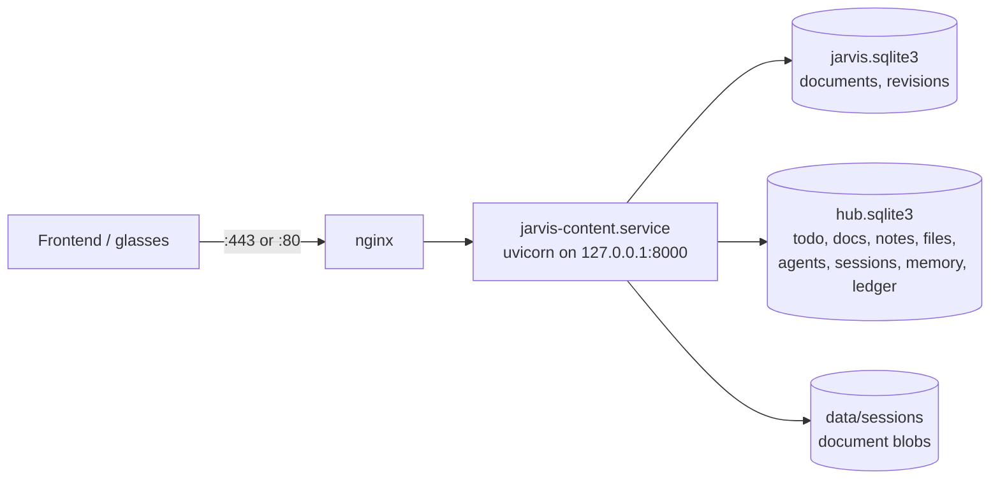
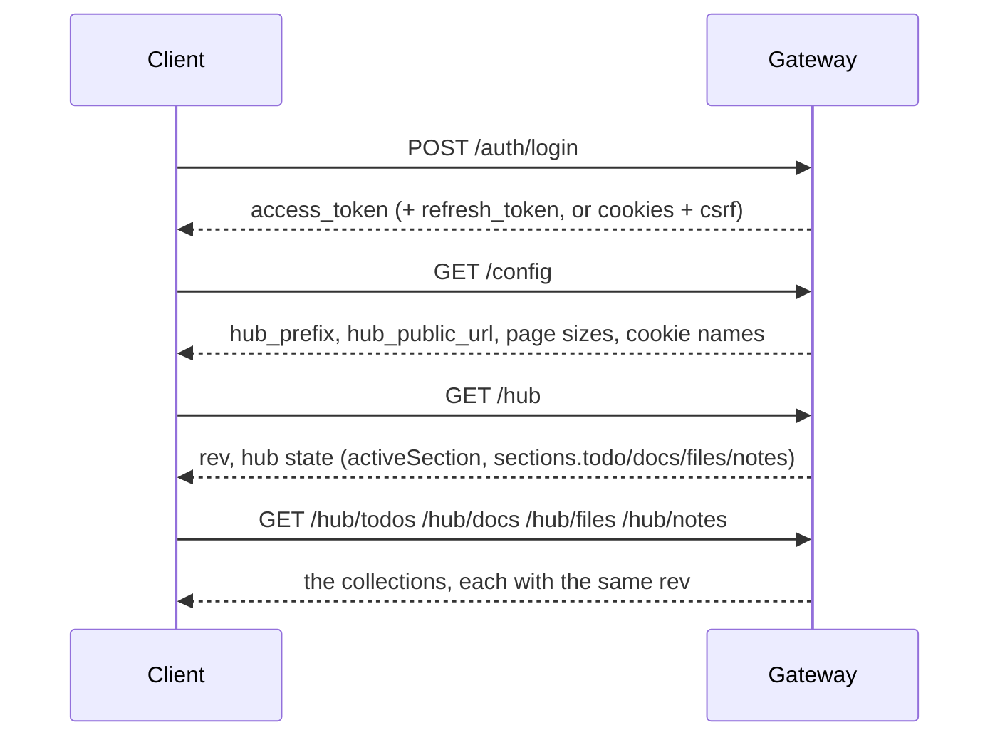

# Jarvis backend - integration specification

**This document is generated.** Every path, parameter name, request field, enum
value, error code and response body in it is read out of the running
application - from its own OpenAPI schema, from the source of the function that
serves each route, and from responses captured by actually calling the routes
against a throwaway database. Nothing here is typed from the design notes, so
when the document and the server disagree, the server is right and this file is
stale.

| | |
| --- | --- |
| Service | `jarvis-content-gateway` version `1.0.0` |
| Routes | 112 (gateway 41, hub 71) |
| MCP tools | 11 (+39 aliases) on the gateway, 12 on the hub |
| Enumerations | 44 closed vocabularies |
| Error codes | 19 machine-readable codes |
| Tables | 22 in the hub database |

## How to read this

Sections 1-4 are the rules: how to authenticate, what a response looks like, how
concurrency is negotiated. Section 5 is the route index. Sections 6-8 are the
reference, grouped by resource. Sections 9-13 are the appendices a client needs
to keep open while coding. Section 14 states what is deliberately not built, and
section 15 is the end-to-end playbook.

If you are wiring a frontend, read **1, 2, 3 and 15** first, then jump to the
resource you are building.


## 1. What you are talking to

One HTTP service, two API families, one credential.



* One process serves everything. There is no second backend to call and no
  service discovery to do.
* The two databases are **separate SQLite files** in the same data directory.
  They are never joined in a query, and a hub request never touches the gateway
  tables. The only link between them is the identity of the caller.
* Every write is transactional and every read is consistent within its own
  database. Cross-family consistency is not offered and is not needed: the
  frontend aggregates client-side.

### Base URLs

| Environment | Base | Notes |
| --- | --- | --- |
| Production | `https://<host>` | nginx terminates TLS and proxies to the app |
| Local / sandbox | `http://127.0.0.1:8000` | the app directly |
| Docs | `/docs`, `/redoc`, `/openapi.json` | only when `ENABLE_DOCS` is true |

The hub is mounted under a **prefix** taken from `HUB_PREFIX` (default `/hub`),
reported by `GET /config` as `hub_prefix` and by `GET /hub/diag/schema`.
`HUB_PUBLIC_URL` overrides the absolute URL a client should use for the hub
(some deployments expose it on its own hostname). A client should read both from
`GET /config` rather than hard-coding `/hub`.


## 2. The two API families

They share an origin, a token and a database directory, and nothing else. The
differences are deliberate and a client must respect them.

| | Gateway (documents) | Hub (everything else) |
| --- | --- | --- |
| Mount | `/` and `/admin`, `/auth`, `/sessions` | `/hub` |
| Purpose | Store HTML documents with a full revision history | The state a phone and a pair of glasses have to agree on |
| Success body | bare object, e.g. `{"items": [...]}` | always `{"ok": true, "rev": n, ...}` |
| Error body | `{"error": {...}}` | `{"ok": false, "error": "message", "code": "...", "details": {}}` |
| Concurrency | `if_version` / `If-Match` | `rev` on the body, plus `If-Match` on agents |
| Identity | JWT / API key | the same JWT / API key |
| Pagination | `limit` + `offset`, `total` | `limit` + `cursor`, `next`, `more` |
| Timestamps | ISO-8601 strings in auth, epoch ms in content | epoch milliseconds everywhere |
| Writes | `PUT`/`PATCH`/`DELETE` on a document | per-collection routes, never a document |
| MCP | `GET,POST /mcp` - 11 tools | `POST /hub/mcp` - 12 tools |

The two error shapes are not a bug to be smoothed over. Code written against the
gateway that assumes `body["error"]["code"]` will read `"this route needs the
rev you are writing against"` (a string) on the hub, index it by character and
produce nonsense. **Brand the two clients apart, or check `"ok" in body` first.**


## 3. Authentication and identity

Full detail, including the refresh design, is in
[authentication.md](authentication.md). This is the part a client has to
implement.

### Getting a token

```
POST /auth/login
{"username": "jarvis", "password": "..."}
```

The response carries `access_token` and `refresh_token` alongside the session
description. Three artifacts exist:

| Artifact | Form | Lifetime | Sent as |
| --- | --- | --- | --- |
| Access token | HS256 JWT | `ACCESS_TOKEN_TTL` (default 900 s) | `Authorization: Bearer <token>` |
| Refresh token | opaque `jvr_...` | `REFRESH_TOKEN_TTL`, sliding | body of `POST /auth/refresh` |
| Session family | UUID | `REFRESH_ABSOLUTE_TTL` hard cap | implicit |

**Refresh tokens are single-use.** Every renewal rotates them. Presenting one
that has already been used is treated as theft: the whole session family is
revoked and the client is logged out. A client must store the new refresh token
from every response and never retry a refresh with the old one.

### Telling the client when to renew

`GET /auth/session` returns both numbers a client needs, and one boolean that
saves it doing the arithmetic:

```
renew_after_seconds   # an AGE threshold: renew once your token is older than this
access_expires_in     # seconds LEFT on the current token
renew_recommended     # true when renewing now is a good idea
```

`renew_after_seconds` is an age, not a countdown. Renewing when
`access_expires_in < renew_after_seconds` is the classic mistake and renews in a
loop.

### Two credential modes

* **Bearer mode** - `Authorization: Bearer <access_token>` on every request.
  Nothing else is required. This is the mode for a device, a script or an app.
* **Cookie mode** - the gateway also sets HttpOnly cookies (`jarvis_at`,
  `jarvis_rt`) and a **readable** `jarvis_csrf`. When cookies are in play,
  every mutating request must echo the cookie in a header:

  ```
  X-CSRF-Token: <value of the jarvis_csrf cookie>
  ```

  Cookie names, the CSRF header name and whether this is required are all
  published by `GET /auth/config` (`cookie_mode`, `cookie_names`, `csrf_header`,
  `csrf_enabled`, `csrf_protect_safe_methods`). Read them; do not hard-code them.

A mixed client (cookie session plus a bearer header) is resolved in favour of
the bearer token. Sending both is not an error.

### API keys

For long-lived integrations that must not hold a password:

```
POST /admin/apikeys                 -> the key, shown exactly once
POST /admin/apikeys/token           -> exchange a key for a short-lived session
DELETE /admin/apikeys/{key_id}      -> revoke
GET  /admin/apikeys                 -> list (never returns the secret again)
```

### Scopes

| Scope | Grants |
| --- | --- |
| `content:read` | read documents, revisions, tags, agents, stats |
| `content:write` | create, update, delete documents |
| `content:admin` | users, API keys, maintenance, config, audit |

A hub request is authorised against the **same** scopes. The hub's MCP tools
declare finer-grained scopes of their own (`sessions:read`, `sessions:write`,
`memory:read`, `memory:write`, `recall`, `ledger:read`, `settings:read`); these
gate which tools a principal can see and call, not which HTTP routes are open.
An account holding `content:admin` bypasses the tool-scope filter entirely.

### When authentication fails

The **status** is shared; the **body** is not. A hub route answers `401` with
`{"ok": false, "error": "...", "code": "NO_CREDENTIAL"}` exactly as a gateway
route answers `401`, but the gateway's body nests under `"error"`. One
credential store, two renderers - see `routes/deps.py`.


## 4. Conventions that apply to every hub route

### 4.1 The success envelope

Every hub response is an object with a boolean `ok` and the collection's current
`rev`:

```json
{ "ok": true, "rev": 38, "updatedAt": 1791046286329, "item": { "...": "..." } }
```

Keys alongside `ok`/`rev` are the payload: `item`, `items`, `doc`, `agents`,
`collections`, and so on. The table for each route in section 6 names them, and
appendix 13 shows a real body for every route that was called.

A `204` has **no body at all**. Do not call `.json()` on it.

### 4.2 The error envelope

```json
{
  "ok": false,
  "error": "this route needs the rev you are writing against",
  "code": "REV_REQUIRED",
  "details": { "field": "rev" }
}
```

`error` is a **human-readable string**, not an object. `code` is the value to
switch on. `details` is optional and, when present, is the part that makes the
failure actionable - it carries the current revision, the offending field, the
allowed values, or the body your earlier call already stored.

The complete code list with HTTP statuses is appendix 11. Two families of
mistake are deliberately split:

* **`INVALID_ENUM`** - a value that must come from a closed vocabulary.
  `details.allowed` lists the whole vocabulary, so a client can render a picker
  from a failure.
* **`VALIDATION_ERROR`** - a type or shape mistake (`done` must be a boolean,
  `entries` must be an array, `summary` must be a string or null).

### 4.3 `rev`: what it covers, and what it does not

`hub_state.rev` is a **control-plane** counter. It advances when, and only when,
one of these five tables is written:

| Table | Written by |
| --- | --- |
| `todo_item` | `/hub/todos*`, the `todo` sync ops |
| `document` | `/hub/docs*`, the `docs` sync ops |
| `note` | `/hub/notes*`, the `notes` sync ops |
| `file_ref` | `/hub/files*`, the `files` sync ops |
| `agent` | `/hub/agents*`, `/hub/tools*` |

**Nothing else moves it.** Sessions, memory, the ledger and settings do not bump
`rev`, and that is deliberate:

* **Sessions** converge by `session_message.seq` under a union merge. Two
  devices appending turns is not a conflict. Had sessions bumped `rev`, every
  turn a phone appended would have invalidated every other client's cached todo
  mirror - a background sync would have been constantly re-fetching state it
  already had.
* **The ledger** is append-only with server-assigned sequence numbers; it has no
  state to conflict over.
* **Memory** is versioned by digest version, not by the control plane.

So a response's `rev` is the *current* revision, not necessarily a new one. A
client must not infer "something changed in the todo list" from the fact that a
memory write returned a `rev`. Compare, do not assume.

**Writing with a stale `rev` is a `409 STALE_REV`**, and the details carry
everything needed to recover without a second round trip:

```json
{ "code": "STALE_REV",
  "details": { "given": 37, "rev": 39, "current": { "...": "the whole hub state" } } }
```

`details.current` is a complete `GET /hub` body. A client can therefore merge
and retry from one failed response. A write with **no** `rev` is a `400`
`REV_REQUIRED`, not a silent last-writer-wins.

### 4.4 `Idempotency-Key`: retrying without fear of doubling

Send a unique header per *operation* (a UUID is fine). If the request succeeds
and is then retried with the same key:

| Case | Result |
| --- | --- |
| First call | `201` (or `200`), the real body |
| Replay, same key and same body | `200`, the **original body** plus `"Duplicate": true`, and a `Duplicate: true` header |
| Same key, **different** body | `409 DUPLICATE_OP`, with `details.current` = the body the first call stored, `details.opId`, `details.appliedAt` |

The replay body is not a fresh write - it is the recorded answer, so it is safe
to treat a replay as success and move on. The `409` branch is the one that
matters: it catches a client reusing a key for a genuinely new edit, which would
otherwise be silently dropped.

A client that does not send the header gets no protection and no penalty. **Do
not** generate the key from the body alone; generate it once per user action and
persist it with the outbox entry, or a retry after a crash will not be a replay.

### 4.5 `If-Match`: item-level concurrency

Agents are edited as whole objects and are guarded by an entity tag instead of
the collection `rev`:

* `GET /hub/agents/{id}` returns an **`ETag`** header, `"<updatedAt>:<hash>"`.
* `PUT`/`DELETE` must send it back as **`If-Match`**.
* Missing -> `412 IF_MATCH_REQUIRED`, with `details.etag` and `details.current`
  so the client can render a merge dialog straight from the failure.
* Mismatched -> `412 IF_MATCH_FAILED`.

Session `PATCH` responses also carry an `etag` **field** (note: no space, in the
body, not a header) for clients that want item-level guards there too.

### 4.6 Pagination

Two idioms, both bounded by `MAX_PAGE_LIMIT = 500`:

* **Cursor** (files, ledger, sessions): `?limit=&cursor=` returns `next` (opaque,
  `null` at the end) and `more` (boolean). Pass `next` back as `cursor`.
* **Sequence** (ledger, session messages): `?sinceSeq=` returns everything after
  that sequence number. Contiguous per user, assigned inside the insert, so it
  cannot miss a row whose clock arrived out of order. This is the only form that
  stays correct while rows are being appended underneath it.

The gateway instead uses `limit` + `offset` and reports `total`.

### 4.7 Timestamps and units

* Hub timestamps are **epoch milliseconds**, integers. Every `*At` field
  (`updatedAt`, `createdAt`, `at`, `digestAt`, `clearedAt`, `serverTime`,
  `generatedAt`).
* Sequence numbers (`seq`, `fromSeq`, `toSeq`, `sinceSeq`) are 1-based integers,
  contiguous per user, and are **not** timestamps.
* Gateway auth responses use ISO-8601 strings (`created_at`,
  `access_expires_at`).
* Counts are integers; `coverage` is a float in `0..1`.

### 4.8 Rate limits

One window is 60 seconds. Every route is charged against `default`; a route with
its own budget is charged against **both**.

| Scope | Per minute | Routes |
| --- | --- | --- |
| `default` | 600 | every hub route |
| `files.publish` | 20 | routes declaring this scope |
| `ledger.append` | 120 | routes declaring this scope |
| `recall` | 30 | routes declaring this scope |
| `sessions.summarize` | 10 | routes declaring this scope |
| `sync.push` | 60 | routes declaring this scope |

Exceeded -> `429 RATE_LIMITED`. The gateway additionally limits `POST /auth/login`
and `POST /auth/refresh` (settings `rate_limit_login_per_minute` and
`rate_limit_refresh_per_minute`).

### 4.9 Which writes need what

Generated from the handlers, so this is the contract and not a summary of it.

| Route | Status | `rev` | `Idempotency-Key` | Rate scope |
| --- | --- | --- | --- | --- |
| `PUT` `/hub` | - | **required** | yes | `default` |
| `PATCH` `/hub` | - | **required** | yes | `default` |
| `POST` `/hub/agents` | 201 | **required** | yes | `default` |
| `PUT` `/hub/agents/{agent_id}` | - | not required | yes | `default` |
| `DELETE` `/hub/agents/{agent_id}` | - | **required** | yes | `default` |
| `POST` `/hub/agents/{agent_id}/clone` | 201 | **required** | yes | `default` |
| `POST` `/hub/docs` | 201 | **required** | yes | `default` |
| `PUT` `/hub/docs/{doc_id}` | - | not required | yes | `default` |
| `PATCH` `/hub/docs/{doc_id}` | - | **required** | yes | `default` |
| `DELETE` `/hub/docs/{doc_id}` | 204 | **required** | yes | `default` |
| `POST` `/hub/files` | 201 | **required** | yes | `files.publish` |
| `DELETE` `/hub/files/{file_id}` | 204 | not required | yes | `default` |
| `POST` `/hub/files/{file_id}/restore` | - | not required | yes | `default` |
| `POST` `/hub/ledger` | 201 | not required | yes | `ledger.append` |
| `POST` `/hub/mcp` | - | - | - | `default` |
| `PUT` `/hub/memory` | - | not required | yes | `default` |
| `DELETE` `/hub/memory` | 204 | **required** | yes | `default` |
| `POST` `/hub/memory/compact` | - | **required** | yes | `default` |
| `POST` `/hub/memory/turns` | - | **required** | yes | `default` |
| `PUT` `/hub/notes` | - | **required** | yes | `default` |
| `POST` `/hub/notes/append` | - | **required** | yes | `default` |
| `POST` `/hub/recall` | - | not required | yes | `recall` |
| `POST` `/hub/sessions` | 201 | **required** | yes | `default` |
| `POST` `/hub/sessions/clear` | - | **required** | yes | `default` |
| `PATCH` `/hub/sessions/{session_id}` | - | - | - | `default` |
| `DELETE` `/hub/sessions/{session_id}` | - | - | - | `default` |
| `POST` `/hub/sessions/{session_id}/messages` | - | **required** | yes | `default` |
| `POST` `/hub/sessions/{session_id}/summarize` | - | **required** | yes | `sessions.summarize` |
| `PUT` `/hub/settings` | - | not required | yes | `default` |
| `PUT` `/hub/settings/secrets` | - | not required | yes | `default` |
| `DELETE` `/hub/settings/secrets/{key}` | - | not required | yes | `default` |
| `POST` `/hub/sync/prime` | - | - | - | `default` |
| `POST` `/hub/sync/push` | - | - | - | `sync.push` |
| `PUT` `/hub/todos` | - | **required** | yes | `default` |
| `POST` `/hub/todos` | 201 | **required** | yes | `default` |
| `POST` `/hub/todos/clear-done` | - | **required** | yes | `default` |
| `POST` `/hub/todos/reorder` | - | **required** | yes | `default` |
| `PATCH` `/hub/todos/{todo_id}` | - | **required** | yes | `default` |
| `DELETE` `/hub/todos/{todo_id}` | 204 | **required** | yes | `default` |
| `POST` `/hub/tools` | 201 | **required** | yes | `default` |
| `PUT` `/hub/tools/{tool_id}` | - | **required** | yes | `default` |
| `DELETE` `/hub/tools/{tool_id}` | - | **required** | yes | `default` |
| `PUT` `/hub/tools/{tool_id}/token` | - | not required | yes | `default` |
| `DELETE` `/hub/tools/{tool_id}/token` | - | not required | yes | `default` |
* **required** - omitting it is `400 REV_REQUIRED`; a stale one is `409 STALE_REV`.
* **not required** - the route is idempotent by other means and must not be
  gated, or the spec leaves its Guard column blank for a reason stated in its
  docstring. Sending a `rev` anyway is harmless.
* **If-Match** - guarded by an entity tag instead (see 4.5).


## 5. Route index

All 112 routes, in the order the server declares them.

| Method | Path | Handler | Parameters | OK | Purpose |
| --- | --- | --- | --- | --- | --- |
| `POST` | `/admin/apikeys` | create_api_key | - | 201 | Mint an API key (shown once) |
| `GET` | `/admin/apikeys` | list_api_keys | - | - | List API keys |
| `POST` | `/admin/apikeys/token` | api_key_token | - | - | Lets a key holder obtain a session without ever putting the key in a URL. |
| `DELETE` | `/admin/apikeys/{key_id}` | revoke_api_key | - | - | Revoke an API key |
| `GET` | `/admin/audit` | audit | - | - | Recent authentication events |
| `GET` | `/admin/config` | config | - | - | Effective configuration (secrets redacted) |
| `POST` | `/admin/import` | bulk_import | - | - | Bulk import documents |
| `POST` | `/admin/maintenance` | maintenance | - | - | Retention, orphan blobs, expired tokens, vacuum |
| `GET` | `/admin/sessions` | active_sessions | - | - | Active token families |
| `POST` | `/admin/sessions/revoke` | revoke_sessions | - | - | Revoke every session of a subject |
| `GET` | `/admin/stats` | stats | - | - | Counts, sizes and session totals |
| `GET` | `/agents` | list_agents | - | - | Distinct agents with document counts |
| `GET` | `/auth/config` | client_config | - | - | Non-secret client configuration |
| `POST` | `/auth/login` | login | - | - | Exchange credentials for a token pair |
| `POST` | `/auth/logout` | logout | - | - | Revoke the current session (or all of them) |
| `POST` | `/auth/refresh` | refresh | - | - | Rotate a refresh token |
| `GET` | `/auth/session` | session | - | - | Describe the current session |
| `GET` | `/config` | config | - | - | Public, non-secret configuration |
| `GET` | `/health` | health | - | - | Liveness, plus what the hub can say about itself (§5.12). |
| `GET` | `/hub` | read_hub | - | - | The whole ``HubState`` plus ``rev``, so the renderer needs no change. |
| `PUT` | `/hub` | replace_hub | - | - | **Whole-state replace** -- the ``v1`` equivalent of ``POST /api/stream``. |
| `PATCH` | `/hub` | patch_hub | - | - | ``{ activeSection?, activeDocId? }`` and nothing else, per §5.1. |
| `GET` | `/hub/agents` | list_agents | - | - | List Agents |
| `POST` | `/hub/agents` | create_agent | - | 201 | Create an agent. ``name`` is the only required field. |
| `GET` | `/hub/agents/{agent_id}` | read_agent | - | - | One agent, with its tools already resolved to full records -- and its ``ETag``. |
| `PUT` | `/hub/agents/{agent_id}` | replace_agent | - | - | **Whole-agent last-write-wins**, guarded by ``If-Match`` (§5.6). |
| `DELETE` | `/hub/agents/{agent_id}` | delete_agent | - | - | Soft delete, and **irreversible**. |
| `POST` | `/hub/agents/{agent_id}/clone` | clone_agent | - | 201 | Copy an agent, its tools and their order. |
| `GET` | `/hub/diag/invariants` | invariants | - | - | Run every §7 check against this database and report each one. |
| `GET` | `/hub/diag/schema` | schema | - | - | The MCP tool schemas as the relay will advertise them, post-fold (§5.12). |
| `GET` | `/hub/docs` | list_docs | - | - | Titles and metadata; bodies only when asked for by name. |
| `POST` | `/hub/docs` | create_doc | - | 201 | Create a document. ``201`` with a ``Location``, per §4.2. |
| `GET` | `/hub/docs/{doc_id}` | read_doc | - | - | One document, with the ``ETag`` a later ``PUT`` must echo. |
| `PUT` | `/hub/docs/{doc_id}` | put_doc | - | - | **The only write to an existing body**, and it requires ``If-Match``. |
| `PATCH` | `/hub/docs/{doc_id}` | patch_doc | - | - | Rename or reorder. **Metadata only, and it says so out loud.** |
| `DELETE` | `/hub/docs/{doc_id}` | delete_doc | - | 204 | Soft delete. ``204``, and the row stays. |
| `GET` | `/hub/docs/{doc_id}/revisions` | doc_revisions | - | - | Reserved, and permanently so for v1. |
| `GET` | `/hub/files` | list_files | - | - | Paged references. The body is never in this response. |
| `POST` | `/hub/files` | publish_file | - | 201 | Publish a body to the gateway, then record the reference to it. |
| `GET` | `/hub/files/stats` | file_stats | - | - | Counts and bytes, with deleted rows reported separately. |
| `GET` | `/hub/files/{file_id}` | read_file | - | - | Metadata only -- never the body. The body is ``/files/:id/text``. |
| `DELETE` | `/hub/files/{file_id}` | delete_file | - | 204 | Hide a reference, or -- with ``?hard=true`` -- remove it and the body. |
| `GET` | `/hub/files/{file_id}/media` | file_media | - | - | The assets the body refers to -- refs only, never the assets themselves. |
| `POST` | `/hub/files/{file_id}/restore` | restore_file | - | - | Bring a soft-deleted reference back. ``200``, not ``201``. |
| `GET` | `/hub/files/{file_id}/revisions` | file_revisions | - | - | The document's history, from the service that keeps it. |
| `GET` | `/hub/files/{file_id}/text` | read_file_text | - | - | The **whole** body, fetched from the gateway. No default window. |
| `GET` | `/hub/ledger` | read_ledger | - | - | Entries, **ascending by default**. |
| `POST` | `/hub/ledger` | append_ledger | - | 201 | Append a burst of entries, in one transaction, numbered by the server. |
| `POST` | `/hub/mcp` | mcp_endpoint | - | - | Mcp Endpoint |
| `GET` | `/hub/memory` | read_memory | - | - | The ``JarvisMemory`` projection. |
| `PUT` | `/hub/memory` | replace_memory | - | - | Replace the whole of memory with what the client sent. |
| `DELETE` | `/hub/memory` | clear_memory | - | 204 | Forget everything, by tombstone. Turns and digests go together. |
| `POST` | `/hub/memory/compact` | compact_memory | - | - | Fold the turns that arrived since the last digest into a **new** version. |
| `POST` | `/hub/memory/turns` | append_turn | - | - | Append **one** turn, which is why the body is a turn and not an array. |
| `GET` | `/hub/notes` | read_notes | - | - | The whole note. |
| `PUT` | `/hub/notes` | replace_note | - | - | Replace the whole note. ``{ content }`` and nothing else. |
| `POST` | `/hub/notes/append` | append_note | - | - | Append text, and hand the client the note as it was **after the first attempt** on a retry. See the module docstring -- this is the route the ``applied_op.result`` column exists for. |
| `POST` | `/hub/recall` | ask_recall | - | - | Turn an utterance into the handful of sessions most likely to answer it. |
| `GET` | `/hub/sessions` | list_sessions | - | - | List Sessions |
| `POST` | `/hub/sessions` | save_session | - | 201 | Save a transcript **and** write its summary, in one request. |
| `POST` | `/hub/sessions/clear` | clear_sessions | - | - | Forget sessions by writing a **tombstone**. Rows are never deleted. |
| `GET` | `/hub/sessions/search` | search_sessions | - | - | Full-text search **over summaries**, never over transcripts (§6.4). |
| `GET` | `/hub/sessions/stats` | session_stats | - | - | Counts, words and **summary coverage** (§6.3). |
| `GET` | `/hub/sessions/{session_id}` | read_session | - | - | Metadata **and no messages**. See the module docstring. |
| `PATCH` | `/hub/sessions/{session_id}` | patch_session | - | - | Patch Session |
| `DELETE` | `/hub/sessions/{session_id}` | delete_session | - | - | Delete Session |
| `GET` | `/hub/sessions/{session_id}/messages` | read_messages | - | - | One page of transcript, ascending by ``seq``. |
| `POST` | `/hub/sessions/{session_id}/messages` | append_messages | - | - | Append turns. Append-only, and a replay is a **success**. |
| `GET` | `/hub/sessions/{session_id}/summaries` | read_summaries | - | - | Every version, newest first. |
| `POST` | `/hub/sessions/{session_id}/summarize` | summarize_session | - | - | Generate a **new** summary version, never an edit of the old one. |
| `GET` | `/hub/settings` | read_settings | - | - | Non-secret settings, plus what the hub knows about each secret's *shape*. |
| `PUT` | `/hub/settings` | replace_settings | - | - | Owner-only, and ``rev_required=False`` because §5.6 leaves the Guard blank. |
| `PUT` | `/hub/settings/secrets` | put_secret | - | - | Store a secret. **Write-only, owner-only, and never echoed back.** |
| `DELETE` | `/hub/settings/secrets/{key}` | delete_secret | - | - | Remove a secret. 404 when there was none. |
| `POST` | `/hub/sync/prime` | prime_sync | - | - | The budgeted offline prime. |
| `GET` | `/hub/sync/pull` | pull_changes | - | - | Everything that moved since ``since``, shaped per collection. |
| `POST` | `/hub/sync/push` | push_ops | - | - | Apply an outbox, one transaction per op, and report each op's fate. |
| `GET` | `/hub/todos` | read_todos | - | - | Every todo, in ordinal order, with the collection's ``rev``. |
| `PUT` | `/hub/todos` | replace_todos | - | - | **Whole-collection replace.** Not a merge -- see the module docstring. |
| `POST` | `/hub/todos` | create_todo | - | 201 | Add one todo. ``201`` with a ``Location``, per §4.2. |
| `POST` | `/hub/todos/clear-done` | clear_done_todos | - | - | Delete every completed todo, reporting how many went. |
| `POST` | `/hub/todos/reorder` | reorder_todos | - | - | Apply a full new order in one atomic rewrite. |
| `PATCH` | `/hub/todos/{todo_id}` | patch_todo | - | - | Change one todo's text, done flag or position. |
| `DELETE` | `/hub/todos/{todo_id}` | delete_todo | - | 204 | Remove one todo. ``204`` with no body, per §4.2. |
| `GET` | `/hub/tools` | list_tools | - | - | Every tool. |
| `POST` | `/hub/tools` | create_tool | - | 201 | Create a tool. User-created tools never appear in the gateway's MCP list. |
| `PUT` | `/hub/tools/{tool_id}` | replace_tool | - | - | Patch a tool. A field set to ``null`` is **cleared**, a field left out is **left alone**. |
| `DELETE` | `/hub/tools/{tool_id}` | delete_tool | - | - | **Hard** delete. ``agent_tool`` cascades, so no agent keeps a dangling id. |
| `PUT` | `/hub/tools/{tool_id}/token` | set_tool_token | - | - | Store a tool's token. **Write-only, owner-only.** |
| `DELETE` | `/hub/tools/{tool_id}/token` | clear_tool_token | - | - | Remove a tool's token. 404 when there was none. |
| `GET` | `/mcp` | mcp_describe | - | - | Describe this MCP endpoint |
| `POST` | `/mcp` | mcp_endpoint | - | - | MCP JSON-RPC endpoint |
| `GET` | `/ready` | ready | - | - | Readiness (touches the database) |
| `GET` | `/revisions` | list_revisions_feed | - | - | Every change, across every document |
| `POST` | `/sessions` | create_session | - | - | Create a document |
| `GET` | `/sessions` | list_sessions | - | - | List documents (SQL-side filter + sort + paginate) |
| `GET` | `/sessions/{session_id}` | get_session | - | - | Read document metadata |
| `PUT` | `/sessions/{session_id}` | replace_session | - | - | Replace a document |
| `PATCH` | `/sessions/{session_id}` | patch_session | - | - | Update selected fields |
| `DELETE` | `/sessions/{session_id}` | delete_session | - | - | Delete a document (soft by default) |
| `GET` | `/sessions/{session_id}/diff` | diff_revisions | - | - | Compare two revisions |
| `GET` | `/sessions/{session_id}/download` | download_session | - | - | Download the document as a file |
| `GET` | `/sessions/{session_id}/html` | get_session_html | - | - | Serve the raw document (for an iframe) |
| `POST` | `/sessions/{session_id}/restore` | restore_session | - | - | Restore a soft-deleted document |
| `GET` | `/sessions/{session_id}/revisions` | list_document_revisions | - | - | One document's history |
| `DELETE` | `/sessions/{session_id}/revisions` | clear_revisions | - | - | Forget a document's whole history |
| `GET` | `/sessions/{session_id}/revisions/{revision}` | get_revision | - | - | Read one revision |
| `DELETE` | `/sessions/{session_id}/revisions/{revision}` | delete_revision | - | - | Forget one revision |
| `GET` | `/sessions/{session_id}/revisions/{revision}/html` | get_revision_html | - | - | Serve a past revision (for an iframe) |
| `POST` | `/sessions/{session_id}/revisions/{revision}/restore` | restore_revision | - | - | Make an old revision current again |
| `GET` | `/tags` | list_tags | - | - | Tags in use, most frequent first |
| `GET` | `/version` | version | - | - | Version banner |


## 6. Hub reference

Grouped by resource. The **Body** column lists the top-level request fields the handler actually reads (AST-extracted). Where a route was called during generation, its real response is reproduced in appendix 13.


### 6.1 Hub control plane


| Method | Path | Body fields | OK | Rate scope | Purpose |
| --- | --- | --- | --- | --- | --- |
| `GET` | `/hub` | - | - | `default` | The whole ``HubState`` plus ``rev``, so the renderer needs no change. |
| `PUT` | `/hub` | `hub` | - | `default` | **Whole-state replace** -- the ``v1`` equivalent of ``POST /api/stream``. |
| `PATCH` | `/hub` | `activeDocId`, `activeSection` | - | `default` | ``{ activeSection?, activeDocId? }`` and nothing else, per §5.1. |


### 6.2 Todos


| Method | Path | Body fields | OK | Rate scope | Purpose |
| --- | --- | --- | --- | --- | --- |
| `GET` | `/hub/todos` | - | - | `default` | Every todo, in ordinal order, with the collection's ``rev``. |
| `PUT` | `/hub/todos` | `items` | - | `default` | **Whole-collection replace.** Not a merge -- see the module docstring. |
| `POST` | `/hub/todos` | `text`, `done` | 201 | `default` | Add one todo. ``201`` with a ``Location``, per §4.2. |
| `POST` | `/hub/todos/clear-done` | - | - | `default` | Delete every completed todo, reporting how many went. |
| `POST` | `/hub/todos/reorder` | `ids` | - | `default` | Apply a full new order in one atomic rewrite. |
| `PATCH` | `/hub/todos/{todo_id}` | `text`, `done`, `ordinal` | - | `default` | Change one todo's text, done flag or position. |
| `DELETE` | `/hub/todos/{todo_id}` | - | 204 | `default` | Remove one todo. ``204`` with no body, per §4.2. |


### 6.3 Docs


| Method | Path | Body fields | OK | Rate scope | Purpose |
| --- | --- | --- | --- | --- | --- |
| `GET` | `/hub/docs` | - | - | `default` | Titles and metadata; bodies only when asked for by name. |
| `POST` | `/hub/docs` | `title`, `content` | 201 | `default` | Create a document. ``201`` with a ``Location``, per §4.2. |
| `GET` | `/hub/docs/{doc_id}` | - | - | `default` | One document, with the ``ETag`` a later ``PUT`` must echo. |
| `PUT` | `/hub/docs/{doc_id}` | `content`, `title` | - | `default` | **The only write to an existing body**, and it requires ``If-Match``. |
| `PATCH` | `/hub/docs/{doc_id}` | `title`, `ordinal` | - | `default` | Rename or reorder. **Metadata only, and it says so out loud.** |
| `DELETE` | `/hub/docs/{doc_id}` | - | 204 | `default` | Soft delete. ``204``, and the row stays. |
| `GET` | `/hub/docs/{doc_id}/revisions` | - | - | `default` | Reserved, and permanently so for v1. |


### 6.4 Notes


| Method | Path | Body fields | OK | Rate scope | Purpose |
| --- | --- | --- | --- | --- | --- |
| `GET` | `/hub/notes` | - | - | `default` | The whole note. |
| `PUT` | `/hub/notes` | `content` | - | `default` | Replace the whole note. ``{ content }`` and nothing else. |
| `POST` | `/hub/notes/append` | `text` | - | `default` | Append text, and hand the client the note as it was **after the first attempt** on a retry. See the module docstring -- this is the route the ``applied_op.result`` column exists for. |


### 6.5 Files


| Method | Path | Body fields | OK | Rate scope | Purpose |
| --- | --- | --- | --- | --- | --- |
| `GET` | `/hub/files` | - | - | `default` | Paged references. The body is never in this response. |
| `POST` | `/hub/files` | `html`, `overwrite`, `id`, `file`, `title`, `agent`, `slug` | 201 | `files.publish` | Publish a body to the gateway, then record the reference to it. |
| `GET` | `/hub/files/stats` | - | - | `default` | Counts and bytes, with deleted rows reported separately. |
| `GET` | `/hub/files/{file_id}` | - | - | `default` | Metadata only -- never the body. The body is ``/files/:id/text``. |
| `DELETE` | `/hub/files/{file_id}` | - | 204 | `default` | Hide a reference, or -- with ``?hard=true`` -- remove it and the body. |
| `GET` | `/hub/files/{file_id}/media` | - | - | `default` | The assets the body refers to -- refs only, never the assets themselves. |
| `POST` | `/hub/files/{file_id}/restore` | - | - | `default` | Bring a soft-deleted reference back. ``200``, not ``201``. |
| `GET` | `/hub/files/{file_id}/revisions` | - | - | `default` | The document's history, from the service that keeps it. |
| `GET` | `/hub/files/{file_id}/text` | - | - | `default` | The **whole** body, fetched from the gateway. No default window. |


### 6.6 Agents and Tools


| Method | Path | Body fields | OK | Rate scope | Purpose |
| --- | --- | --- | --- | --- | --- |
| `GET` | `/hub/agents` | - | - | `default` | List Agents |
| `POST` | `/hub/agents` | `name`, `systemPrompt`, `prompt`, `toolIds`, `model` | 201 | `default` | Create an agent. ``name`` is the only required field. |
| `GET` | `/hub/agents/{agent_id}` | - | - | `default` | One agent, with its tools already resolved to full records -- and its ``ETag``. |
| `PUT` | `/hub/agents/{agent_id}` | `name`, `systemPrompt`, `prompt`, `toolIds`, `model` | - | `default` | **Whole-agent last-write-wins**, guarded by ``If-Match`` (§5.6). |
| `DELETE` | `/hub/agents/{agent_id}` | - | - | `default` | Soft delete, and **irreversible**. |
| `POST` | `/hub/agents/{agent_id}/clone` | - | 201 | `default` | Copy an agent, its tools and their order. |


### 6.7 Tools


| Method | Path | Body fields | OK | Rate scope | Purpose |
| --- | --- | --- | --- | --- | --- |
| `GET` | `/hub/tools` | - | - | `default` | Every tool. |
| `POST` | `/hub/tools` | `name`, `url`, `method`, `bodyTemplate`, `searchDepth`, `kind`, `description` | 201 | `default` | Create a tool. User-created tools never appear in the gateway's MCP list. |
| `PUT` | `/hub/tools/{tool_id}` | - | - | `default` | Patch a tool. A field set to ``null`` is **cleared**, a field left out is **left alone**. |
| `DELETE` | `/hub/tools/{tool_id}` | - | - | `default` | **Hard** delete. ``agent_tool`` cascades, so no agent keeps a dangling id. |
| `PUT` | `/hub/tools/{tool_id}/token` | `token` | - | `default` | Store a tool's token. **Write-only, owner-only.** |
| `DELETE` | `/hub/tools/{tool_id}/token` | - | - | `default` | Remove a tool's token. 404 when there was none. |


### 6.8 Settings and secrets


| Method | Path | Body fields | OK | Rate scope | Purpose |
| --- | --- | --- | --- | --- | --- |
| `GET` | `/hub/settings` | - | - | `default` | Non-secret settings, plus what the hub knows about each secret's *shape*. |
| `PUT` | `/hub/settings` | `searchProvider`, `depth`, `clear` | - | `default` | Owner-only, and ``rev_required=False`` because §5.6 leaves the Guard blank. |
| `PUT` | `/hub/settings/secrets` | `key`, `value` | - | `default` | Store a secret. **Write-only, owner-only, and never echoed back.** |
| `DELETE` | `/hub/settings/secrets/{key}` | - | - | `default` | Remove a secret. 404 when there was none. |


### 6.9 Sessions


| Method | Path | Body fields | OK | Rate scope | Purpose |
| --- | --- | --- | --- | --- | --- |
| `GET` | `/hub/sessions` | - | - | `default` | List Sessions |
| `POST` | `/hub/sessions` | `kind`, `agentId`, `runId`, `title`, `status`, `messages`, `summarise`, `summary`, `respond` | 201 | `default` | Save a transcript **and** write its summary, in one request. |
| `POST` | `/hub/sessions/clear` | `agentId` | - | `default` | Forget sessions by writing a **tombstone**. Rows are never deleted. |
| `GET` | `/hub/sessions/search` | - | - | `default` | Full-text search **over summaries**, never over transcripts (§6.4). |
| `GET` | `/hub/sessions/stats` | - | - | `default` | Counts, words and **summary coverage** (§6.3). |
| `GET` | `/hub/sessions/{session_id}` | - | - | `default` | Metadata **and no messages**. See the module docstring. |
| `PATCH` | `/hub/sessions/{session_id}` | - | - | `default` | Patch Session |
| `DELETE` | `/hub/sessions/{session_id}` | - | - | `default` | Delete Session |
| `GET` | `/hub/sessions/{session_id}/messages` | - | - | `default` | One page of transcript, ascending by ``seq``. |
| `POST` | `/hub/sessions/{session_id}/messages` | `messages` | - | `default` | Append turns. Append-only, and a replay is a **success**. |
| `GET` | `/hub/sessions/{session_id}/summaries` | - | - | `default` | Every version, newest first. |
| `POST` | `/hub/sessions/{session_id}/summarize` | `summary`, `respond` | - | `sessions.summarize` | Generate a **new** summary version, never an edit of the old one. |


### 6.10 Memory


| Method | Path | Body fields | OK | Rate scope | Purpose |
| --- | --- | --- | --- | --- | --- |
| `GET` | `/hub/memory` | - | - | `default` | The ``JarvisMemory`` projection. |
| `PUT` | `/hub/memory` | `digest`, `turns` | - | `default` | Replace the whole of memory with what the client sent. |
| `DELETE` | `/hub/memory` | - | 204 | `default` | Forget everything, by tombstone. Turns and digests go together. |
| `POST` | `/hub/memory/compact` | `respond` | - | `default` | Fold the turns that arrived since the last digest into a **new** version. |
| `POST` | `/hub/memory/turns` | - | - | `default` | Append **one** turn, which is why the body is a turn and not an array. |


### 6.11 Recall


| Method | Path | Body fields | OK | Rate scope | Purpose |
| --- | --- | --- | --- | --- | --- |
| `POST` | `/hub/recall` | `includeMessages`, `minScore`, `text`, `limit`, `top` | - | `recall` | Turn an utterance into the handful of sessions most likely to answer it. |


### 6.12 Ledger


| Method | Path | Body fields | OK | Rate scope | Purpose |
| --- | --- | --- | --- | --- | --- |
| `GET` | `/hub/ledger` | - | - | `default` | Entries, **ascending by default**. |
| `POST` | `/hub/ledger` | `entries` | 201 | `ledger.append` | Append a burst of entries, in one transaction, numbered by the server. |


### 6.13 Sync


| Method | Path | Body fields | OK | Rate scope | Purpose |
| --- | --- | --- | --- | --- | --- |
| `POST` | `/hub/sync/prime` | `collections`, `budget` | - | `default` | The budgeted offline prime. |
| `GET` | `/hub/sync/pull` | - | - | `default` | Everything that moved since ``since``, shaped per collection. |
| `POST` | `/hub/sync/push` | `ops` | - | `sync.push` | Apply an outbox, one transaction per op, and report each op's fate. |


### 6.14 Diagnostics


| Method | Path | Body fields | OK | Rate scope | Purpose |
| --- | --- | --- | --- | --- | --- |
| `GET` | `/hub/diag/invariants` | - | - | `default` | Run every §7 check against this database and report each one. |
| `GET` | `/hub/diag/schema` | - | - | `default` | The MCP tool schemas as the relay will advertise them, post-fold (§5.12). |


### 6.15 MCP over the hub


| Method | Path | Body fields | OK | Rate scope | Purpose |
| --- | --- | --- | --- | --- | --- |
| `POST` | `/hub/mcp` | - | - | `default` | Mcp Endpoint |


## 7. Gateway reference

Documents, revisions and administration. Bodies follow the gateway's own shapes; see the OpenAPI schema for the full definitions.


| Method | Path | Params | OK | Handler | Purpose |
| --- | --- | --- | --- | --- | --- |
| `POST` | `/admin/apikeys` | - | 201 | create_api_key | Mint an API key (shown once) |
| `GET` | `/admin/apikeys` | - | - | list_api_keys | List API keys |
| `POST` | `/admin/apikeys/token` | - | - | api_key_token | Lets a key holder obtain a session without ever putting the key in a URL. |
| `DELETE` | `/admin/apikeys/{key_id}` | - | - | revoke_api_key | Revoke an API key |
| `GET` | `/admin/audit` | - | - | audit | Recent authentication events |
| `GET` | `/admin/config` | - | - | config | Effective configuration (secrets redacted) |
| `POST` | `/admin/import` | - | - | bulk_import | Bulk import documents |
| `POST` | `/admin/maintenance` | - | - | maintenance | Retention, orphan blobs, expired tokens, vacuum |
| `GET` | `/admin/sessions` | - | - | active_sessions | Active token families |
| `POST` | `/admin/sessions/revoke` | - | - | revoke_sessions | Revoke every session of a subject |
| `GET` | `/admin/stats` | - | - | stats | Counts, sizes and session totals |
| `GET` | `/agents` | - | - | list_agents | Distinct agents with document counts |
| `GET` | `/auth/config` | - | - | client_config | Non-secret client configuration |
| `POST` | `/auth/login` | - | - | login | Exchange credentials for a token pair |
| `POST` | `/auth/logout` | - | - | logout | Revoke the current session (or all of them) |
| `POST` | `/auth/refresh` | - | - | refresh | Rotate a refresh token |
| `GET` | `/auth/session` | - | - | session | Describe the current session |
| `GET` | `/config` | - | - | config | Public, non-secret configuration |
| `GET` | `/health` | - | - | health | Liveness, plus what the hub can say about itself (§5.12). |
| `GET` | `/mcp` | - | - | mcp_describe | Describe this MCP endpoint |
| `POST` | `/mcp` | - | - | mcp_endpoint | MCP JSON-RPC endpoint |
| `GET` | `/ready` | - | - | ready | Readiness (touches the database) |
| `GET` | `/revisions` | - | - | list_revisions_feed | Every change, across every document |
| `POST` | `/sessions` | - | - | create_session | Create a document |
| `GET` | `/sessions` | - | - | list_sessions | List documents (SQL-side filter + sort + paginate) |
| `GET` | `/sessions/{session_id}` | - | - | get_session | Read document metadata |
| `PUT` | `/sessions/{session_id}` | - | - | replace_session | Replace a document |
| `PATCH` | `/sessions/{session_id}` | - | - | patch_session | Update selected fields |
| `DELETE` | `/sessions/{session_id}` | - | - | delete_session | Delete a document (soft by default) |
| `GET` | `/sessions/{session_id}/diff` | - | - | diff_revisions | Compare two revisions |
| `GET` | `/sessions/{session_id}/download` | - | - | download_session | Download the document as a file |
| `GET` | `/sessions/{session_id}/html` | - | - | get_session_html | Serve the raw document (for an iframe) |
| `POST` | `/sessions/{session_id}/restore` | - | - | restore_session | Restore a soft-deleted document |
| `GET` | `/sessions/{session_id}/revisions` | - | - | list_document_revisions | One document's history |
| `DELETE` | `/sessions/{session_id}/revisions` | - | - | clear_revisions | Forget a document's whole history |
| `GET` | `/sessions/{session_id}/revisions/{revision}` | - | - | get_revision | Read one revision |
| `DELETE` | `/sessions/{session_id}/revisions/{revision}` | - | - | delete_revision | Forget one revision |
| `GET` | `/sessions/{session_id}/revisions/{revision}/html` | - | - | get_revision_html | Serve a past revision (for an iframe) |
| `POST` | `/sessions/{session_id}/revisions/{revision}/restore` | - | - | restore_revision | Make an old revision current again |
| `GET` | `/tags` | - | - | list_tags | Tags in use, most frequent first |
| `GET` | `/version` | - | - | version | Version banner |


## 8. Data model

The hub keeps its own SQLite database. These are the tables it is built from, read out of the schema module - useful for reasoning about what a route can return, and for writing a data migration.


| Table | Columns |
| --- | --- |
| `app_user` | `id`, `email`, `created_at`, `last_seen_at` |
| `app_setting` | `user_id`, `key`, `value`, `updated_at` |
| `app_secret` | `user_id`, `key`, `ciphertext`, `hint`, `updated_at` |
| `hub_state` | `user_id`, `active_section`, `active_doc_id`, `rev`, `updated_at` |
| `todo_item` | `id`, `user_id`, `ordinal`, `text`, `done`, `created_at`, `updated_at` |
| `document` | `id`, `user_id`, `ordinal`, `title`, `--`, `--`, `content`, `created_at`, `updated_at`, `deleted_at` |
| `note` | `user_id`, `content`, `updated_at` |
| `file_ref` | `id`, `user_id`, `title`, `agent`, `slug`, `tags`, `url`, `size`, `version`, `updated_at`, `deleted_at`, `deleted_reason` |
| `llm_settings` | `user_id`, `provider`, `model`, `referer`, `title`, `updated_at` |
| `tool` | `id`, `user_id`, `name`, `kind`, `description`, `url`, `method`, `body_template`, `--`, `has_token`, `search_depth`, `ordinal`, `updated_at` |
| `agent` | `id`, `user_id`, `name`, `system_prompt`, `prompt`, `model`, `created_at`, `updated_at`, `deleted_at` |
| `agent_tool` | `agent_id`, `tool_id`, `ordinal` |
| `jarvis_session` | `id`, `user_id`, `kind`, `agent_id`, `run_id`, `title`, `--`, `--`, `--`, `--`, `--`, `status`, `started_at`, `ended_at`, `updated_at`, `turn_count`, `word_count`, `summary_version`, `deleted_at`, `pinned` |
| `session_message` | `id`, `session_id`, `seq`, `role`, `content`, `tool`, `--`, `args`, `at`, `--`, `--`, `--` |
| `session_summary` | `session_id`, `version`, `at`, `model`, `kind`, `text`, `concepts`, `entities`, `decisions`, `tasks`, `source_seq_from`, `source_seq_to`, `tokens`, `superseded_at` |
| `session_tombstone` | `user_id`, `agent_id`, `cleared_at` |
| `memory_turn` | `id`, `user_id`, `session_id`, `role`, `text`, `at` |
| `memory_digest` | `user_id`, `version`, `text`, `folded`, `model`, `at` |
| `memory_usage` | `user_id`, `words`, `turns`, `updated_at` |
| `ledger_entry` | `user_id`, `seq`, `run_id`, `at`, `kind`, `by`, `effect`, `status`, `text`, `refs`, `locus`, `payload` |
| `applied_op` | `user_id`, `op_id`, `applied_at`, `body_hash`, `result` |
| `client_cursor` | `device_id`, `collection`, `rev`, `at` |


## 9. MCP: two endpoints, one protocol

Both speak JSON-RPC 2.0 over HTTP. They are different servers with different
tool sets, and they are not interchangeable.

| | Gateway `GET,POST /mcp` | Hub `POST /hub/mcp` |
| --- | --- | --- |
| Tools | 11 (`create_session` ... `revision_stats`) | 12 (`sessions_save` ... `settings_read`) |
| Subject | documents and revisions | todo, docs, notes, sessions, memory, recall, ledger, settings |
| Auth | same credential | same credential; tools additionally filtered by scope |
| `GET` | describes the endpoint in HTML/JSON | not served |
| Notifications | accepted | accepted; a request without `id` returns `204` with no body |

A client that wants everything must attach to **both**. The gateway's tool
vocabulary is documented in [mcp.md](mcp.md); the hub's is below.

### 9.1 Wire format

```
POST /hub/mcp
{"jsonrpc": "2.0", "id": 1, "method": "tools/list", "params": {}}
```

Supported methods: `initialize`, `tools/list`, `tools/call`. Anything else is
`-32601 Method not found`. A message with **no `id`** is a notification and
returns `204` with an empty body - a client that waits for JSON on that response
will hang, so check the status before parsing.

Parse and protocol failures use the standard codes and are **not** wrapped in
the hub envelope, because a JSON-RPC client is parsing this layer:

| Code | Meaning |
| --- | --- |
| `-32700` | parse error - the body was not JSON |
| `-32600` | invalid request - not a JSON-RPC 2.0 object |
| `-32601` | method not found |
| `-32602` | invalid params - e.g. `params.name` missing or `params.arguments` not an object |
| `-32603` | internal error - the tool raised |
| `-32000` | the tool ran and refused; `message` carries the hub error's text |

A tool that raises is reported **inside** a successful JSON-RPC result with
`isError: true`, so the model can read the reason instead of the transport
failing. Tool failures are conversational; transport failures are not.

### 9.2 Server identity

The hub reports itself as `g2-even-hub` version `1.0.0`, protocol
`2024-11-05`. Tool names must match `^[a-z][a-z0-9_]*$`, are capped at 64
characters, and at most 64 tools are advertised.

### 9.3 Tool visibility is scoped, and fails closed

`tools/list` returns only the tools the caller's scopes allow. An account with
`content:admin` sees all 12. Every other principal sees the intersection of its
scopes and each tool's declared scope - and an unrecognised scope means the tool
is **hidden**, not shown. `GET /hub/diag/schema` reports the fold: how many
tools were declared, how many were advertised, and which were excluded and why.

### 9.4 The gateway's tools

Eleven tools over documents and revisions. Every canonical name maps to itself,
so a name returned by `tools/list` is always callable; 39 further
aliases exist so an agent can work from prose (`mcp.create`, `get`, `ls`,
`mcp.delete("session", id)`), and none of those are advertised.

| Tool | Purpose |
| --- | --- |
| `create_session` | create or overwrite a document |
| `read_session` | metadata, optionally with the body |
| `update_session` | patch or replace a document |
| `delete_session` | soft delete (hard delete on request) |
| `list_sessions` | filter/sort/paginate |
| `search_sessions` |  |
| `session_stats` | counts and storage usage |
| `list_revisions` | the content history, one document or all of them |
| `read_revision` | one historical revision, optionally with the body |
| `restore_revision` |  |
| `revision_stats` | how much history is stored |

The reading tools are open to `content:read`. `restore_revision` replaces the
document's current body, so it needs `content:write`.

### 9.5 The hub's tools

| Tool | Scope | Required | Optional |
| --- | --- | --- | --- |
| `sessions_save` | `sessions:write` | `kind`, `messages` | `title`, `agentId`, `runId`, `summary`, `summarise` |
| `sessions_list` | `sessions:read` | - | `kind`, `agentId`, `limit`, `cursor`, `pinned` |
| `sessions_read` | `sessions:read` | `sessionId` | `includeMessages`, `summaryVersion` |
| `sessions_search` | `sessions:read` | `q` | `entities`, `concepts`, `tasks`, `from`, `to`, `limit` |
| `sessions_summarize` | `sessions:write` | `sessionId` | `sinceSeq` |
| `sessions_clear` | `sessions:write` | - | `agentId`, `sessionId` |
| `sessions_stats` | `sessions:read` | - | - |
| `memory_read` | `memory:read` | - | `turns` |
| `memory_write` | `memory:write` | `role`, `text` | `sessionId` |
| `recall` | `recall` | `text` | `limit`, `top`, `minScore` |
| `ledger_read` | `ledger:read` | - | `runId`, `sinceSeq`, `limit` |
| `settings_read` | `settings:read` | - | - |

A tool name that is not in this list, or is not visible to the caller, is
`-32601`. Calling one the caller cannot see is the same answer as calling one
that does not exist - deliberately, so the tool list is not a scope oracle.


## 10. Response entities

These are the shapes the serializers emit. A route that returns an entity returns exactly these keys.


| Entity | Always present | May be present | Returned by | Source |
| --- | --- | --- | --- | --- |
| `todo_item` | `id`, `text`, `done` | - | `PATCH /hub/todos/{todo_id}`, `POST /hub/todos` | TodoItem {id, text, done} -- exactly three fields (types.ts). |
| `document` | `id`, `title`, `updatedAt` | `content` | `GET /hub/docs/{doc_id}/revisions`, `GET /hub/docs/{doc_id}`, `GET /hub/docs` | DocEntry {id, title, content, updatedAt}. |
| `note` | `content`, `updatedAt` | - | `GET /hub/memory`, `GET /hub/notes`, `GET /hub/sessions/{session_id}`, `GET /hub/sync/pull`, `GET /hub`, `GET /sessions/{session_id}` | The single note blob. An absent row is an empty note, not a 404. |
| `file_ref` | `id`, `title`, `agent`, `url`, `size`, `tags`, `updatedAt` | `slug`, `version`, `deletedAt`, `deletedReason` | `GET /hub/files/{file_id}`, `GET /hub/files` | A FileRef. Never a body: the table has no such column (§3.3). |
| `agent` | `id`, `name`, `systemPrompt`, `prompt`, `toolIds`, `createdAt`, `updatedAt` | `model` | `GET /hub/agents/{agent_id}`, `POST /hub/agents`, `PUT /hub/agents/{agent_id}` | AgentDef, with toolIds assembled from agent_tool. |
| `tool` | `id`, `name`, `kind`, `description`, `hasToken` | `url`, `method`, `searchDepth` | `DELETE /hub/tools/{tool_id}/token`, `GET /hub/diag/schema`, `POST /hub/tools`, `PUT /hub/tools/{tool_id}/token`, `PUT /hub/tools/{tool_id}` | ToolDef. hasToken is the boolean; the token itself never appears. |
| `llm_settings` | `provider`, `model`, `referer`, `title`, `hasKey` | - | `PUT /hub/settings` | LlmSettings. hasKey is passed in, never read from a column. |
| `session` | `id`, `kind`, `agentId`, `title`, `status`, `createdAt`, `updatedAt`, `turnCount`, `wordCount`, `summaryVersion`, `pinned` | `runId`, `endedAt` | `DELETE /hub/sessions/{session_id}`, `DELETE /sessions/{session_id}`, `GET /auth/session`, `PATCH /hub/sessions/{session_id}`, `PATCH /sessions/{session_id}`, `POST /sessions` | Session metadata. **Not** its messages -- GET /sessions/:id omits them. |
| `message` | `seq`, `role`, `content`, `at` | `tool`, `args` | `GET /hub/sessions/{session_id}/messages` | AgentMessage {role, content, tool?, args?, at}. |
| `summary` | `version`, `text`, `model`, `kind`, `generatedAt`, `concepts`, `entities`, `decisions`, `tasks` | `tokens`, `supersededAt` | `DELETE /hub/settings/secrets/{key}`, `GET /hub/sessions/search`, `GET /hub/sessions/{session_id}/summaries`, `GET /hub/settings`, `PUT /hub/settings/secrets`, `PUT /hub/settings` | A versioned summary. Every version is kept; supersededAt says which is live. |
| `ledger_entry` | `seq`, `runId`, `at`, `kind`, `by`, `effect`, `status`, `text`, `refs` | `locus`, `payload` | `GET /hub/ledger`, `POST /admin/import`, `POST /hub/ledger`, `POST /hub/sessions/{session_id}/messages` | A ledger row. refs is JSON-array text in the column, a list on the wire. |
| `hub_state` | `activeSection`, `sections`, `activeDocId`, `updatedAt` | `truncated` | `GET /hub/memory`, `GET /hub/sessions/{session_id}`, `GET /hub`, `GET /sessions/{session_id}` | The HubState a cold boot renders from -- one projection, no joins. |


## 11. Error codes

`code` is the machine-readable discriminant. HTTP status is derived from it, so a client may switch on either.


| Code | HTTP |
| --- | --- |
| `INVALID_ENUM` | `400` |
| `REV_REQUIRED` | `400` |
| `VALIDATION_ERROR` | `400` |
| `BAD_CREDENTIAL` | `401` |
| `NO_CREDENTIAL` | `401` |
| `SCOPE_DENIED` | `403` |
| `NOT_FOUND` | `404` |
| `DUPLICATE_FILE` | `409` |
| `DUPLICATE_OP` | `409` |
| `STALE_REV` | `409` |
| `IF_MATCH_FAILED` | `412` |
| `IF_MATCH_REQUIRED` | `412` |
| `TOO_LARGE` | `413` |
| `RATE_LIMITED` | `429` |
| `INTERNAL` | `500` |
| `NOT_IMPLEMENTED` | `501` |
| `GATEWAY_DOWN` | `503` |
| `NOT_CONFIGURED` | `503` |
| `PROVIDER_DOWN` | `503` |


**Not every `404` is `NOT_FOUND`.** `PUT /hub/docs` (the collection) is not a route, so it falls through to the hub catch-all and answers `404` with `details.id` naming the path. Only `GET` exists at `/hub/docs`.


## 12. Enumerations

Every closed vocabulary, so a client can offer a picker without a round trip and so `INVALID_ENUM` is impossible to hit by accident.


| Enum | Values | Members |
| --- | --- | --- |
| `CLIENT_SESSION_STATUSES` | 3 | `running` `done` `error` |
| `COLLECTIONS` | 11 | `hub` `todo` `docs` `notes` `files` `agents` `tools` `settings` `sessions` `memory` `ledger` |
| `HTTP_METHODS` | 2 | `GET` `POST` |
| `LEDGER_BYS` | 5 | `wearer` `jarvis` `agent` `jev` `system` |
| `LEDGER_EFFECTS` | 4 | `pure` `read` `write` `irreversible` |
| `LEDGER_KINDS` | 10 | `ask` `delta` `route` `call` `result` `reply` `decision` `gate` `note` `error` |
| `LEDGER_LOCI` | 2 | `client` `relay` |
| `LEDGER_STATUSES` | 5 | `pending` `ok` `failed` `skipped` `declined` |
| `MCP_SCOPES` | 7 | `sessions:read` `sessions:write` `memory:read` `memory:write` `recall` `ledger:read` `settings:read` |
| `MESSAGE_ROLES` | 4 | `user` `assistant` `tool` `system` |
| `OP_ACTIONS` | 7 | `create` `update` `delete` `replace` `append` `clear` `reorder` |
| `OP_ACTIONS_BY_COLLECTION` | map | `hub` -> [`replace`] `todo` -> [`create`, `update`, `delete`, `replace`, `clear`, `reorder`] `docs` -> [`create`, `update`, `delete`, `replace`] `notes` -> [`replace`, `append`, `clear`] `files` -> [`create`, `update`, `delete`, `replace`] `agents` -> [`create`, `update`, `delete`] `tools` -> [`create`, `update`, `delete`] `settings` -> [`update`, `replace`] `sessions` -> [`create`, `append`, `update`, `delete`, `clear`, `update-summary`] `memory` -> [`append`, `replace`, `clear`] `ledger` -> [`append`] |
| `SEARCH_PROVIDERS` | 2 | `tavily` `brave` |
| `SECRET_SETTING_KEYS` | 4 | `llm` `search:tavily` `search:brave` `tool:` |
| `SECTION_IDS` | 5 | `todo` `docs` `files` `notes` `agents` |
| `SESSION_KINDS` | 3 | `agent` `voice` `note` |
| `SESSION_STATUSES` | 4 | `running` `done` `error` `stopped` |
| `SUMMARY_KINDS` | 3 | `digest` `manual` `rollup` |
| `TOOL_KINDS` | 9 | `web` `tavily` `http` `jev` `files` `todo` `docs` `notes` `location` |
| `WEB_DEPTHS` | 2 | `basic` `advanced` |
| `WEB_TOOL_KINDS` | 2 | `web` `tavily` |
| `WRITABLE_SECRET_KEYS` | 3 | `llm` `search:tavily` `search:brave` |


### 12.1 Constants

| Constant | Value |
| --- | --- |
| `BODY_MAX_CHARS` | `60000` |
| `DEFAULT_LLM_MODEL` | `inclusionai/ling-3.0-flash-sante:free` |
| `DEFAULT_LLM_PROVIDER` | `openrouter` |
| `DEFAULT_PAGE_LIMIT` | `50` |
| `GATED_EFFECT` | `irreversible` |
| `GATE_KIND` | `gate` |
| `HUB_FILES_LIMIT` | `50` |
| `MAX_PAGE_LIMIT` | `500` |
| `MCP_MAX_TOOLS` | `64` |
| `MCP_MAX_TOOL_NAME` | `64` |
| `MCP_PROTOCOL_VERSION` | `2024-11-05` |
| `MCP_SERVER_NAME` | `g2-even-hub` |
| `MCP_SERVER_VERSION` | `1.0.0` |
| `MCP_TOOL_NAME_RE_TEXT` | `^[a-z][a-z0-9_]*$` |
| `MEMORY_DIGEST_WORDS` | `400` |
| `MEMORY_MAX_WORDS` | `4000` |
| `SECRET_LLM` | `llm` |
| `SECRET_SEARCH_BRAVE` | `search:brave` |
| `SECRET_SEARCH_TAVILY` | `search:tavily` |
| `SECRET_TOOL_PREFIX` | `tool:` |
| `SETTING_DEPTH` | `depth` |
| `SETTING_SEARCH_PROVIDER` | `searchProvider` |


## 13. Observed wire traffic

Every body below came back from the running application, called over HTTP against a throwaway database. They are recorded as **key-and-type shape summaries**, not as raw payloads, because a payload is one sample and a shape is the contract:

* `str 'todo'` - a string, shown with the value it held in that call
* `int`, `bool`, `null` - those types
* `[]` - an empty list
* `[1] { ... }` - a list of 1 element, whose shape follows
* `{ ... }` - a nested object

The capture ran against an empty database, so lists are mostly `[]`; the shape of a list element is in section 10, not here. Where a table above and a body below disagree, the body is what the server actually sent.


#### `GET /hub` -> 200

```
{
  ok: bool
  rev: int
  updatedAt: int
  hub: {
    activeSection: str 'todo'
    sections: {
      todo: []
      docs: []
      files: []
      notes: str ''
    }
    activeDocId: null
    updatedAt: int
  }
  truncated: bool
}
```


#### `PUT /hub` -> 200

```
{
  ok: bool
  rev: int
  updatedAt: int
  hub: {
    activeSection: str 'todo'
    sections: {
      todo: []
      docs: []
      files: []
      notes: str ''
    }
    activeDocId: null
    updatedAt: int
  }
}
```


#### `PATCH /hub` -> 200

```
{
  ok: bool
  rev: int
  updatedAt: int
  hub: {
    activeSection: str 'todo'
    sections: {
      todo: []
      docs: []
      files: []
      notes: str ''
    }
    activeDocId: null
    updatedAt: int
  }
}
```


#### `GET /hub/agents` -> 200

```
{
  ok: bool
  rev: int
  agents: [1] {
    id: str
    name: str 'Researcher'
    systemPrompt: str 'be terse'
    prompt: str 'What is new in AI this week?'
    toolIds: [1] str 'tool-tavily'
    createdAt: int
    updatedAt: int
  }
  tools: [1] {
    id: str 'tool-tavily'
    name: str 'tavily_search'
    kind: str 'tavily'
    description: str
    hasToken: bool
    searchDepth: str 'basic'
  }
  llm: {
    provider: str 'openrouter'
    model: str
    referer: str ''
    title: str ''
    hasKey: bool
  }
  updatedAt: int
}
```


#### `POST /hub/agents` -> 201

```
{
  ok: bool
  rev: int
  agents: [1] {
    id: str
    name: str 'Researcher'
    systemPrompt: str 'be terse'
    prompt: str 'What is new in AI this week?'
    toolIds: [1] str 'tool-tavily'
    createdAt: int
    updatedAt: int
  }
  tools: [1] {
    id: str 'tool-tavily'
    name: str 'tavily_search'
    kind: str 'tavily'
    description: str
    hasToken: bool
    searchDepth: str 'basic'
  }
  llm: {
    provider: str 'openrouter'
    model: str
    referer: str ''
    title: str ''
    hasKey: bool
  }
  updatedAt: int
}
```


#### `GET /hub/agents/{agent_id}` -> 200

```
    header ETag: '"1791046334592:e4e7f1b4c97a7b36"'
    header etag: '"1791046334592:e4e7f1b4c97a7b36"'
{
  ok: bool
  rev: int
  agent: {
    id: str
    name: str 'Guarded'
    systemPrompt: str 'x'
    prompt: str 'What is new in AI this week?'
    toolIds: [1] str 'tool-tavily'
    createdAt: int
    updatedAt: int
  }
}
```


#### `PUT /hub/agents/{agent_id}` -> 412

```
{
  ok: bool
  error: str
  code: str 'IF_MATCH_REQUIRED'
  details: {
    current: {
      id: str
      name: str 'Researcher'
      systemPrompt: str 'be terse'
      prompt: str 'What is new in AI this week?'
      toolIds: [1] str 'tool-tavily'
      createdAt: int
      updatedAt: int
    }
    etag: str '"1791046331358:3705db17190cdc39"'
  }
}
```


#### `POST /hub/agents/{agent_id}/clone` -> 201

```
{
  ok: bool
  rev: int
  agents: [2] {
    id: str
    name: str 'Researcher clone'
    systemPrompt: str 'be terse'
    prompt: str 'What is new in AI this week?'
    toolIds: [1] str 'tool-tavily'
    createdAt: int
    updatedAt: int
  }
  tools: [1] {
    id: str 'tool-tavily'
    name: str 'tavily_search'
    kind: str 'tavily'
    description: str
    hasToken: bool
    searchDepth: str 'basic'
  }
  llm: {
    provider: str 'openrouter'
    model: str
    referer: str ''
    title: str ''
    hasKey: bool
  }
  updatedAt: int
}
```


#### `GET /hub/diag/invariants` -> 200

```
{
  ok: bool
  rev: int
  checkedAt: int
  checks: [12] {
    name: str 'filesNoBody'
    ok: bool
    count: int
    detail: str
    sample: []
  }
  failures: [1] str 'sessionMonotonic'
}
```


#### `GET /hub/diag/schema` -> 200

```
{
  ok: bool
  rev: int
  protocolVersion: str '2024-11-05'
  serverInfo: {
    name: str 'g2-even-hub'
    version: str '1.0.0'
  }
  capabilities: {
    tools: {
      listChanged: bool
    }
  }
  count: int
  tools: [12] {
    name: str 'sessions_save'
    description: str
    inputSchema: {
      type: str 'object'
      properties: {
        kind: {…}
        title: {…}
        agentId: {…}
        runId: {…}
        messages: {…}
        summary: {…}
        summarise: {…}
      }
      required: [2] str 'kind'
      additionalProperties: bool
    }
  }
  scopes: [7] str 'ledger:read'
  fold: {
    ok: bool
    declared: int
    advertised: int
    dropped: []
    scopeProblems: []
    excluded: {
      count: int
      names: [1] str 'tool-tavily'
      reason: str
    }
    namePattern: str '^[a-z][a-z0-9_]*$'
    maxTools: int
    maxToolName: int
    tools: [12] {
      name: str 'sessions_save'
      description: str
      inputSchema: {
        type: str 'object'
        properties: {…}
        required: [2] str 'kind'
        additionalProperties: bool
      }
    }
  }
}
```


#### `GET /hub/docs` -> 200

```
{
  ok: bool
  rev: int
  updatedAt: int
  items: []
  includeContent: bool
}
```


#### `POST /hub/docs` -> 201

```
{
  ok: bool
  rev: int
  updatedAt: int
  doc: {
    id: str
    title: str 'Second doc'
    content: str 'body'
    updatedAt: int
  }
}
```


#### `GET /hub/docs/{doc_id}` -> 200

```
{
  ok: bool
  rev: int
  doc: {
    id: str
    title: str 'Second doc'
    content: str 'body'
    updatedAt: int
  }
}
```


#### `PATCH /hub/docs/{doc_id}` -> 200

```
{
  ok: bool
  rev: int
  updatedAt: int
  doc: {
    id: str
    title: str 'Second doc (edited)'
    content: str 'body'
    updatedAt: int
  }
}
```


#### `DELETE /hub/docs/{doc_id}` -> 204

```
   <empty body>
```


#### `GET /hub/docs/{doc_id}/revisions` -> 501

```
{
  ok: bool
  error: str 'doc revisions are not implemented'
  code: str 'NOT_IMPLEMENTED'
}
```


#### `GET /hub/files` -> 200

```
{
  ok: bool
  rev: int
  items: []
  next: null
  more: bool
  limit: int
}
```


#### `GET /hub/files/stats` -> 200

```
{
  ok: bool
  rev: int
  total: int
  bytes: int
  deleted: int
  byAgent: {}
}
```


#### `GET /hub/files/{file_id}` -> 200

```
{
  ok: bool
  rev: int
  total: int
  bytes: int
  deleted: int
  byAgent: {}
}
```


#### `GET /hub/ledger` -> 200

```
{
  ok: bool
  rev: int
  items: []
  next: null
  more: bool
  limit: int
}
```


#### `POST /hub/ledger` -> 201

```
{
  ok: bool
  rev: int
  appended: int
  fromSeq: int
  toSeq: int
  entries: [1] {
    seq: int
    runId: str
    at: int
    kind: str 'ask'
    by: str 'wearer'
    effect: str 'pure'
    status: str 'ok'
    text: str 'what is the weather'
    refs: []
  }
}
```


#### `POST /hub/mcp` -> 200

```
{
  jsonrpc: str '2.0'
  id: int
  result: {
    tools: [12] {
      name: str 'sessions_save'
      description: str
      inputSchema: {
        type: str 'object'
        properties: {…}
        required: [2] str 'kind'
        additionalProperties: bool
      }
    }
  }
}
```


#### `GET /hub/memory` -> 200

```
{
  ok: bool
  rev: int
  versions: int
  digest: str ''
  digestAt: int
  folded: int
  turns: int
  words: int
  liveWords: int
  capWords: int
  digestWords: int
}
```


#### `PUT /hub/memory` -> 200

```
{
  ok: bool
  rev: int
  added: int
  versions: int
  digest: str 'remember this'
  digestAt: int
  folded: int
  turns: int
  words: int
  liveWords: int
  capWords: int
  digestWords: int
}
```


#### `DELETE /hub/memory` -> 204

```
   <empty body>

===== 5xx responses: 1 =====
  FAIL GET /hub/docs/3415e926-3cca-4cce-96e7-2135a642928a/revisions
```


#### `POST /hub/memory/compact` -> 200

```
{
  ok: bool
  rev: int
  compacted: bool
  compactSkipped: str 'no provider'
  versions: int
  digest: str 'remember this'
  digestAt: int
  folded: int
  turns: int
  words: int
  liveWords: int
  capWords: int
  digestWords: int
  version: int
}
```


#### `POST /hub/memory/turns` -> 200

```
{
  ok: bool
  rev: int
  added: int
  versions: int
  digest: str 'remember this'
  digestAt: int
  folded: int
  turns: int
  words: int
  liveWords: int
  capWords: int
  digestWords: int
}
```


#### `GET /hub/notes` -> 200

```
{
  ok: bool
  rev: int
  content: str ''
  updatedAt: int
}
```


#### `PUT /hub/notes` -> 200

```
{
  ok: bool
  rev: int
  content: str 'a note'
  updatedAt: int
}
```


#### `POST /hub/notes/append` -> 200

```
{
  ok: bool
  rev: int
  content: str 'a note and more'
  updatedAt: int
}
```


#### `POST /hub/recall` -> 200

```
{
  ok: bool
  rev: int
  selected: []
  candidates: int
  ranked: bool
  reason: str 'nothing to rank'
  serverTime: int
}
```


#### `GET /hub/sessions` -> 200

```
{
  ok: bool
  rev: int
  items: [1] {
    id: str
    kind: str 'note'
    agentId: null
    title: str 'A note session'
    status: str 'running'
    createdAt: int
    updatedAt: int
    turnCount: int
    wordCount: int
    summaryVersion: int
    pinned: bool
  }
  next: null
  more: bool
  limit: int
  tombstone: {
    all: null
    byAgent: {}
  }
}
```


#### `POST /hub/sessions` -> 201

```
{
  ok: bool
  rev: int
  sessionId: str
  applied: bool
  seq: int
  summary: null
  summarised: bool
  summariseSkipped: str 'no provider'
}
```


#### `POST /hub/sessions/clear` -> 200

```
{
  ok: bool
  rev: int
  clearedAt: int
  agentId: str 'jarvis'
}
```


#### `GET /hub/sessions/stats` -> 200

```
{
  ok: bool
  rev: int
  sessions: int
  turns: int
  words: int
  summaries: int
  summarised: int
  unsummarised: int
  coverage: float
  byKind: {}
  tombstone: {
    all: null
    byAgent: {}
  }
}
```


#### `GET /hub/sessions/{session_id}` -> 200

```
{
  ok: bool
  rev: int
  sessions: int
  turns: int
  words: int
  summaries: int
  summarised: int
  unsummarised: int
  coverage: float
  byKind: {}
  tombstone: {
    all: null
    byAgent: {}
  }
}
```


#### `PATCH /hub/sessions/{session_id}` -> 200

```
{
  ok: bool
  rev: int
  id: str
  kind: str 'note'
  agentId: null
  title: str 'renamed'
  status: str 'running'
  createdAt: int
  updatedAt: int
  turnCount: int
  wordCount: int
  summaryVersion: int
  pinned: bool
  etag: str '"1791046331702-850ec53c6ac3"'
}
```


#### `DELETE /hub/sessions/{session_id}` -> 204

```
   <empty body>
```


#### `GET /hub/sessions/{session_id}/messages` -> 200

```
{
  ok: bool
  rev: int
  items: [2] {
    seq: int
    role: str 'user'
    content: str 'hello'
    at: int
  }
  next: null
  more: bool
  limit: int
}
```


#### `POST /hub/sessions/{session_id}/messages` -> 200

```
{
  ok: bool
  rev: int
  applied: bool
  seq: int
}
```


#### `GET /hub/sessions/{session_id}/summaries` -> 200

```
{
  ok: bool
  rev: int
  sessionId: str
  items: []
  count: int
}
```


#### `POST /hub/sessions/{session_id}/summarize` -> 400

```
{
  ok: bool
  error: str 'summary must be a string or null'
  code: str 'VALIDATION_ERROR'
  details: {
    field: str 'summary'
  }
}
```


#### `GET /hub/settings` -> 200

```
{
  ok: bool
  rev: int
  settings: {}
  llm: {
    provider: str 'openrouter'
    model: str 'inclusionai/ling-3.0-flash-sante:free'
    referer: str ''
    title: str ''
    hasKey: bool
  }
  secrets: {}
  secretStorage: bool
}
```


#### `PUT /hub/settings` -> 200

```
{
  ok: bool
  rev: int
  settings: {}
  llm: {
    provider: str 'openrouter'
    model: str
    referer: str ''
    title: str ''
    hasKey: bool
  }
  secrets: {}
  secretStorage: bool
}
```


#### `PUT /hub/settings/secrets` -> 200

```
{
  ok: bool
  rev: int
  settings: {}
  llm: {
    provider: str 'openrouter'
    model: str
    referer: str ''
    title: str ''
    hasKey: bool
  }
  secrets: {
    llm: {
      configured: bool
      hint: str 'not-a…cret'
      updatedAt: int
    }
  }
  secretStorage: bool
}
```


#### `DELETE /hub/settings/secrets/{key}` -> 200

```
{
  ok: bool
  rev: int
  settings: {}
  llm: {
    provider: str 'openrouter'
    model: str
    referer: str ''
    title: str ''
    hasKey: bool
  }
  secrets: {}
  secretStorage: bool
}
```


#### `POST /hub/sync/prime` -> 200

```
{
  ok: bool
  rev: int
  collections: {
    hub: {
      rev: int
      updatedAt: int
      replace: {
        activeSection: str 'todo'
        sections: {
          todo: [2] {…}
          docs: []
          files: []
          notes: str 'a note and more'
        }
        activeDocId: null
        updatedAt: int
      }
    }
    todo: {
      rev: int
      updatedAt: int
      replace: [2] {
        id: str
        text: str 'first'
        done: bool
      }
    }
  }
  deleted: {
    docs: [1] str
    files: []
  }
  truncated: {
    hub: bool
    todo: bool
  }
  serverTime: int
  prime: {
    budget: int
    size: int
    truncated: bool
  }
}
```


#### `GET /hub/sync/pull` -> 200

```
{
  ok: bool
  rev: int
  collections: {
    todo: {
      rev: int
      updatedAt: int
      replace: [2] {
        id: str
        text: str 'first'
        done: bool
      }
    }
    docs: {
      rev: int
      updatedAt: int
      replace: []
    }
    notes: {
      rev: int
      updatedAt: int
      replace: str 'a note and more'
    }
    sessions: {
      rev: int
      updatedAt: int
      items: []
      tombstones: {
        all: null
        byAgent: {
          jarvis: int
        }
      }
      sinceSeq: int
    }
  }
  deleted: {
    docs: [1] str
    files: []
  }
  truncated: {
    todo: bool
    docs: bool
    notes: bool
    sessions: bool
  }
  serverTime: int
}
```


#### `POST /hub/sync/push` -> 200

```
{
  ok: bool
  rev: int
  applied: [1] str
  duplicate: []
  rejected: []
  serverTime: int
}
```


#### `GET /hub/todos` -> 200

```
{
  ok: bool
  rev: int
  updatedAt: int
  items: []
}
```


#### `PUT /hub/todos` -> 200

```
{
  ok: bool
  rev: int
  updatedAt: int
  items: [1] {
    id: str
    text: str 'first'
    done: bool
  }
}
```


#### `POST /hub/todos` -> 400

```
{
  ok: bool
  error: str 'done must be true or false'
  code: str 'VALIDATION_ERROR'
  details: {
    field: str 'done'
  }
}
```


#### `POST /hub/todos/clear-done` -> 200

```
{
  ok: bool
  rev: int
  updatedAt: int
  removed: int
}
```


#### `POST /hub/todos/reorder` -> 200

```
{
  ok: bool
  rev: int
  updatedAt: int
  items: [1] {
    id: str
    text: str 'first'
    done: bool
  }
}
```


#### `PATCH /hub/todos/{todo_id}` -> 200

```
{
  ok: bool
  rev: int
  updatedAt: int
  item: {
    id: str
    text: str 'second renamed'
    done: bool
  }
}
```


#### `DELETE /hub/todos/{todo_id}` -> 204

```
   <empty body>
```


#### `GET /hub/tools` -> 200

```
{
  ok: bool
  rev: int
  items: [2] {
    id: str 'tool-tavily'
    name: str 'tavily_search'
    kind: str 'tavily'
    description: str
    hasToken: bool
    searchDepth: str 'basic'
  }
  updatedAt: int
}
```


#### `POST /hub/tools` -> 201

```
{
  ok: bool
  rev: int
  items: [2] {
    id: str 'tool-tavily'
    name: str 'tavily_search'
    kind: str 'tavily'
    description: str
    hasToken: bool
    searchDepth: str 'basic'
  }
  updatedAt: int
}
```


#### `PUT /hub/tools/{tool_id}` -> 200

```
{
  ok: bool
  rev: int
  items: [2] {
    id: str 'tool-tavily'
    name: str 'web_lookup'
    kind: str 'tavily'
    description: str 'search the web'
    hasToken: bool
    searchDepth: str 'basic'
  }
  updatedAt: int
}
```


#### `DELETE /hub/tools/{tool_id}` -> 200

```
{
  ok: bool
  rev: int
  items: [1] {
    id: str
    name: str 'web_lookup'
    kind: str 'web'
    description: str 'search'
    hasToken: bool
  }
  updatedAt: int
}
```


#### `PUT /hub/tools/{tool_id}/token` -> 200

```
{
  ok: bool
  rev: int
  tool: {
    id: str 'tool-tavily'
    name: str 'web_lookup'
    kind: str 'tavily'
    description: str 'search the web'
    hasToken: bool
    searchDepth: str 'basic'
  }
}
```


#### `DELETE /hub/tools/{tool_id}/token` -> 200

```
{
  ok: bool
  rev: int
  tool: {
    id: str 'tool-tavily'
    name: str 'web_lookup'
    kind: str 'tavily'
    description: str 'search the web'
    hasToken: bool
    searchDepth: str 'basic'
  }
}
```


#### `GET /admin/config` -> 200

```
{
  service_name: str 'jarvis-content-gateway'
  environment: str 'development'
  base_url: str ''
  api_prefix: str ''
  hub_prefix: str '/hub'
  hub_public_url: str ''
  jwt_issuer: str 'jarvis-content-gateway'
  jwt_audience: str 'jarvis-content-api'
  jwt_algorithm: str 'HS256'
  access_token_ttl: int
  refresh_token_ttl: int
  refresh_absolute_ttl: int
  refresh_reuse_grace: float
  renew_skew: int
  cookie_enabled: bool
  cookie_domain: str ''
  cookie_secure: bool
  cookie_samesite: str 'lax'
  cookie_path: str '/'
  refresh_cookie_path: str '/'
  access_cookie_name: str 'jarvis_at'
  refresh_cookie_name: str 'jarvis_rt'
  csrf_cookie_name: str 'jarvis_csrf'
  csrf_header_name: str 'X-CSRF-Token'
  csrf_enabled: bool
  csrf_protect_safe_methods: bool
  max_html_bytes: int
  default_agent: str 'jarvis'
  default_page_size: int
  max_page_size: int
  max_import_items: int
  track_revisions: bool
  revision_retention: int
  revision_max_age_days: int
  revision_snapshots: bool
  data_dir: str '/tmp/tmpv_0nuvgy/data'
  database_path: str '/tmp/tmpv_0nuvgy/data/jarvis.sqlite3'
  sessions_dir: str '/tmp/tmpv_0nuvgy/data/sessions'
  revisions_dir: str '/tmp/tmpv_0nuvgy/data/revisions'
  retention_days: int
  purge_batch_size: int
  audit_retention_days: int
  trust_proxy_headers: bool
  cors_origins: []
  allowed_hosts: []
  enable_docs: bool
  log_level: str 'warning'
  rate_limit_login_per_minute: int
  rate_limit_refresh_per_minute: int
  mcp_enabled: bool
  mcp_require_auth: bool
  mcp_path: str '/mcp'
  request_max_seconds: float
  users: [1] {
    username: str 'jarvis'
    scopes: [3] str 'content:read'
    disabled: bool
    label: str 'primary admin'
    password_source: str 'hash'
  }
  warnings: []
  allow_insecure_defaults: bool
  jwt_secret: str 'set'
  llm_api_key: str 'missing'
  jwt_secret_length: int
  is_production: bool
  renew_after_seconds: int
  refresh_path: str '/'
  access_ttl_human: str '1m'
  refresh_ttl_human: str '10m'
  absolute_ttl_human: str '20m'
}
```


#### `GET /admin/stats` -> 200

```
{
  sessions: int
  live_sessions: int
  deleted_sessions: int
  agents: int
  bytes: int
  oldest_created_at: null
  newest_created_at: null
  tags: int
  database_bytes: int
  storage_bytes: int
  revisions: {
    revisions: int
    documents_tracked: int
    revisions_with_bytes: int
    content_changes: int
    revision_bytes: int
    oldest_revision: null
    newest_revision: null
    changes_by_kind: {}
    snapshots: int
    snapshot_bytes: int
    snapshot_root: str '/tmp/tmpv_0nuvgy/data/revisions'
    retention: int
    max_age_days: int
  }
  users: int
  active_sessions: int
}
```


#### `GET /agents` -> 200

```
{
  items: []
}
```


#### `GET /auth/config` -> 200

```
{
  service: str 'jarvis-content-gateway'
  version: str '1.0.0'
  access_ttl_seconds: int
  refresh_ttl_seconds: int
  refresh_absolute_ttl_seconds: int
  renew_skew_seconds: int
  renew_after_seconds: int
  reuse_grace_seconds: float
  cookie_mode: bool
  cookie_names: {
    access: str 'jarvis_at'
    refresh: str 'jarvis_rt'
    csrf: str 'jarvis_csrf'
  }
  csrf_header: str 'X-CSRF-Token'
  allowed_content_types: [3] str 'text/html'
  max_html_bytes: int
  default_page_size: int
  max_page_size: int
  mcp_path: str '/mcp'
  sort_orders: [8] str 'created_desc'
  default_agent: str 'jarvis'
}
```


#### `GET /auth/session` -> 200

```
{
  subject: str 'jarvis'
  kind: str 'session'
  scopes: [3] str 'content:read'
  session_id: str '49425da63c711610d43db09f995c463b'
  session_active: bool
  refresh_count: int
  created_at: str '2026-10-03T16:50:34.571763+00:00'
  last_used_at: str '2026-10-03T16:50:34.571777+00:00'
  absolute_expires_at: str '2026-10-03T17:10:34.571340+00:00'
  access_expires_at: str '2026-10-03T16:51:34.145472+00:00'
  access_expires_in: int
  renew_recommended: bool
  renew_after_seconds: int
}
```


#### `GET /config` -> 200

```
{
  service_name: str 'jarvis-content-gateway'
  environment: str 'development'
  base_url: str ''
  api_prefix: str ''
  hub_prefix: str '/hub'
  hub_public_url: str ''
  jwt_issuer: str 'jarvis-content-gateway'
  jwt_audience: str 'jarvis-content-api'
  jwt_algorithm: str 'HS256'
  access_token_ttl: int
  refresh_token_ttl: int
  refresh_absolute_ttl: int
  refresh_reuse_grace: float
  renew_skew: int
  cookie_enabled: bool
  cookie_domain: str ''
  cookie_secure: bool
  cookie_samesite: str 'lax'
  cookie_path: str '/'
  refresh_cookie_path: str '/'
  access_cookie_name: str 'jarvis_at'
  refresh_cookie_name: str 'jarvis_rt'
  csrf_cookie_name: str 'jarvis_csrf'
  csrf_header_name: str 'X-CSRF-Token'
  csrf_enabled: bool
  csrf_protect_safe_methods: bool
  max_html_bytes: int
  default_agent: str 'jarvis'
  default_page_size: int
  max_page_size: int
  max_import_items: int
  track_revisions: bool
  revision_retention: int
  revision_max_age_days: int
  revision_snapshots: bool
  data_dir: str '/tmp/tmpv_0nuvgy/data'
  database_path: str '/tmp/tmpv_0nuvgy/data/jarvis.sqlite3'
  sessions_dir: str '/tmp/tmpv_0nuvgy/data/sessions'
  revisions_dir: str '/tmp/tmpv_0nuvgy/data/revisions'
  retention_days: int
  purge_batch_size: int
  audit_retention_days: int
  trust_proxy_headers: bool
  cors_origins: []
  allowed_hosts: []
  enable_docs: bool
  log_level: str 'warning'
  rate_limit_login_per_minute: int
  rate_limit_refresh_per_minute: int
  mcp_enabled: bool
  mcp_require_auth: bool
  mcp_path: str '/mcp'
  request_max_seconds: float
  users: [1] {
    username: str 'jarvis'
    scopes: [3] str 'content:read'
    disabled: bool
    label: str 'primary admin'
    password_source: str 'plaintext'
  }
  warnings: []
  allow_insecure_defaults: bool
  jwt_secret: str 'set'
  llm_api_key: str 'missing'
  jwt_secret_length: int
  is_production: bool
  renew_after_seconds: int
  refresh_path: str '/'
  access_ttl_human: str '1m'
  refresh_ttl_human: str '10m'
  absolute_ttl_human: str '20m'
}
```


#### `GET /health` -> 200

```
{
  status: str 'ok'
  version: str '1.0.0'
  uptime_seconds: float
  ok: bool
  db: str 'up'
  migrations: int
  time: int
}
```


#### `POST /mcp` -> 200

```
{
  jsonrpc: str '2.0'
  id: int
  result: {
    tools: [11] {
      name: str 'create_session'
      description: str
      inputSchema: {
        type: str 'object'
        required: [1] str 'html'
        properties: {…}
      }
    }
  }
}
```


#### `GET /ready` -> 200

```
{
  status: str 'ready'
  version: str '1.0.0'
  sessions: int
  storage_bytes: int
  data_dir: str '/tmp/tmpv_0nuvgy/data'
}
```


#### `GET /revisions` -> 200

```
{
  items: []
  total: int
  count: int
  limit: int
  offset: int
  order: str 'revision_desc'
  changes: {}
}
```


#### `GET /sessions` -> 200

```
{
  items: []
  total: int
  limit: int
  offset: int
  count: int
  has_more: bool
  next_offset: null
}
```


#### `GET /tags` -> 200

```
{
  items: []
}
```


#### `GET /version` -> 200

```
{
  service: str 'jarvis-content-gateway'
  version: str '1.0.0'
  now: str '2026-10-03T16:50:36.160510+00:00'
}
```


## 14. Known gaps

Declared surface that is not implemented, stated plainly so a client does not build against it.

### 14.1 Document revisions

```
GET /hub/docs/{doc_id}/revisions -> 501 NOT_IMPLEMENTED
{"ok": false, "error": "doc revisions are not implemented", "code": "NOT_IMPLEMENTED"}
```

The route exists and is deliberately unimplemented. Do not build a doc-history UI against it. **Files and agents do keep revisions** (`/hub/files/{id}/revisions`, and the gateway's `/sessions/{id}/revisions`), so history exists for those.

### 14.2 Recall ranking

`POST /hub/recall` accepts `minScore` and `includeMessages` but rejects both with `501`. They are reserved.

### 14.3 What is not exposed

* Internal validation helpers return `500`, not a domain code - the hub is trusted as the only writer of its own database.
* Data imported from the app export contains 21 messages with `U+FFFD` replacement characters and one session title that is entirely `U+FFFD`; that is in the source export, not introduced by ingestion.


## 15. Integration playbook

### 15.1 Boot sequence



Cache `rev` from the freshest response. It is your write token.

### 15.2 One write, end to end

```mermaid
sequenceDiagram
    participant C as Client
    participant H as Hub
    C->>C: key = uuid4()  (stored with the outbox entry)
    C->>H: POST /hub/todos {rev: 38, text: "buy milk"}
Idempotency-Key: key
    H-->>C: 201 {ok, rev: 39, item}
    Note over C,H: network drops before the client sees the reply
    C->>H: POST /hub/todos (same body, same key)
    H-->>C: 200 {ok, Duplicate: true, rev: 39, item}
```

* Read `rev` from the **response** and store it. Every successful write returns
  the new one.
* On `409 STALE_REV`, take `details.current`, merge, and retry. Do not refetch.
* On `409 DUPLICATE_OP` with a *different* body, you reused a key: the stored
  body is in `details.current`. Show it, or drop and re-issue with a fresh key.

### 15.3 Offline queue

1. Generate the `Idempotency-Key` when the **user acts**, not when you send.
   Persist it with the queued operation.
2. Persist the `rev` you wrote against? No - **do not**. Queue the operation,
   send it with whatever `rev` is current at flush time, and handle `STALE_REV`
   by merging from `details.current`.
3. Flush in order. On `429`, back off - a replay storm and an attack look
   identical to the limiter.
4. A `200` with `Duplicate: true` means a previous attempt already landed. Treat
   it as success and clear the queue entry.

### 15.4 Two devices, one state

* Todo, docs, notes and files converge through `rev` and the sync ops.
* Sessions converge by `seq`. Appending the same turn twice is a **success**
  (the route is append-only and idempotent on `seq`), so a device may replay its
  queue freely.
* Use `POST /hub/sync/pull` for a catch-up and `POST /hub/sync/push` for a
  batched flush. `sync/pull` returns per-collection `rev`, `updatedAt`,
  `replace`, plus `deleted` and `truncated`. `sync/push` reports `applied`,
  `duplicate` and `rejected` **per op id**, so a partially-rejected batch is
  visible and the accepted part is not lost.
* `POST /hub/sync/prime` fills a cold client and honours a `budget`, reporting
  `prime.size`, `prime.truncated` and per-collection `truncated` flags. If
  `truncated` is true, keep paging - do not assume the snapshot is complete.

### 15.5 Building each screen

| Screen | Routes |
| --- | --- |
| Todo list | `GET /hub/todos`, `POST /hub/todos`, `PATCH /hub/todos/{id}`, `POST /hub/todos/reorder`, `POST /hub/todos/clear-done` |
| Document viewer | `GET /hub/docs?include=content`, `GET /hub/docs/{id}`, `GET /hub`, `PATCH /hub` to move `activeDocId` |
| Notes | `GET /hub/notes`, `PUT /hub/notes`, `POST /hub/notes/append` |
| Files | `GET /hub/files`, `POST /hub/files`, `GET /hub/files/{id}/text`, `GET /hub/files/{id}/media` |
| Agents | `GET /hub/agents`, `POST /hub/agents` to create, `PUT /hub/agents/{id}` with `If-Match`, `DELETE /hub/agents/{id}`, `POST /hub/agents/{id}/clone` |
| Voice / agent runs | `POST /hub/sessions`, `POST /hub/sessions/{id}/messages`, `POST /hub/sessions/{id}/summarize`, `GET /hub/sessions/search` |
| Memory | `GET /hub/memory`, `POST /hub/memory/turns`, `POST /hub/memory/compact` |
| Timeline | `POST /hub/ledger`, `GET /hub/ledger?runId=&sinceSeq=` |
| Settings | `GET /hub/settings`, `PUT /hub/settings`, `PUT /hub/settings/secrets` |
| Health | `GET /health`, `GET /ready`, `GET /hub/diag/invariants` |

### 15.6 Traps, in the order they bite

1. **The error envelope is not the gateway's.** `body["code"]`, never
   `body["error"]["code"]`. `body["error"]` is a sentence.
2. **`204` has no body.** Sessions delete, memory clear and doc delete are all
   `204`.
3. **`rev` does not move for sessions, memory, ledger or settings.** Do not
   treat a returned `rev` as evidence of control-plane change.
4. **`renew_after_seconds` is an age, not a countdown.** Use
   `renew_recommended` if in doubt.
5. **A `200` with `Duplicate: true` is a success**, not a conflict.
6. **`summary` is a string or null.** It is not an object; posting one is a
   `400`.
7. **The ledger takes `{"entries": [...]}`**, an array, and validates the whole
   batch before writing any of it. An irreversible `effect` requires an earlier
   `ok` gate entry in the same run, in this batch or an earlier one.
8. **`If-Match` on agents is mandatory**, and the `412` hands you both the etag
   and the current object.
9. **Doc revisions return `501`.** `GET /hub/docs/{id}/revisions` is declared
   and deliberately not implemented - do not build a history UI against it
   without asking. See 14.1.
10. **The hub is not mounted on the gateway's prefix.** Use
    `GET /config`'s `hub_prefix` / `hub_public_url`.
11. **Tool visibility fails closed.** If a scope string is not recognised the
    tool disappears; a frontend that shows a fixed tool list will disagree with
    `tools/list`.
12. **`OPTIONS`/CORS is opt-in.** `cors_origins` defaults to empty, so a
    browser on another origin gets nothing until it is configured.
