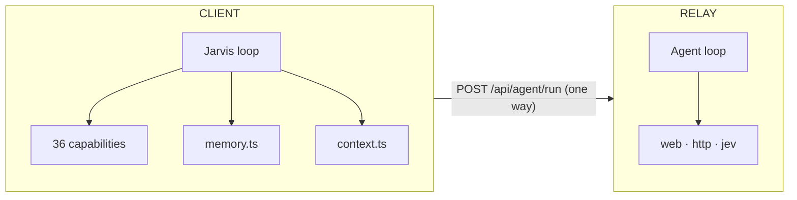

# Jarvis context + jev-as-reranker — design plan

Status: **approved direction, partially implemented.** This document is the
design record. See "What shipped" at the bottom for what exists in code today.

---

## 1. The starting point: two loops that share no layer

The app has two AI loops. They were built independently and they meet in exactly
one place.

| | Jarvis | User agents |
|---|---|---|
| Where it runs | **client** (WebView / browser) | **relay** (`web/server/local-sse.mjs`) |
| Module | `glasses/src/ai/agent.ts` | `executeRun()` |
| Tools | **36 capabilities** (`glasses/src/ai/capabilities/`) | tool *kinds* only: `web`, `http`, `jev` |
| Context | `appSnapshotText()` + `memoryPromptText()` + `pageCatalogText()` | none — a cold `[system, user]` pair per run |
| State between turns | `ai/memory.ts` (digest + turns, persisted) | none — every run starts fresh |

`agents.trigger` is the **only** bridge, and it is one-way and fire-and-forget:
Jarvis starts a run and watches it. An agent cannot call back into Jarvis, and
cannot use a Jarvis capability.



**Consequence that shapes everything below:** "give agents the app's tools" is
not a feature addition, it is a *placement* decision. The capabilities are
client-side functions; the agent loop is on the relay.

Corrections to the review that prompted this plan:

- The tool catalog is **not** a single `tavily_search`. `ToolKind` is
  `'web' | 'http' | 'jev'` (`'tavily'` is still accepted as a legacy alias and is
  migrated on load), all three are implemented in the relay's
  `runToolOnce`, and the builder offers all three. The `web` kind is itself
  provider-swappable — Tavily or Brave Search, chosen in Settings — via
  `web/server/web-search.mjs`; see `docs/agent-architecture.md` §9.
- Per-agent model override **does** exist (`AgentDef.model`, editor field, and
  both run paths honour it). What is missing is per-*step*.
- Truncated transcripts were **fixed** (v0.3.28) — a 5-step run now reads back
  whole. This mattered because transcript-feed-forward depends on it.

Confirmed real gaps: speech replaces the saved prompt (no delta); no mid-run
injection; no chaining; no shared context between runs; flat agent config; no
scheduling; no human gate on an agent write.

---

## 2. Three primitives

### 2.1 Context bundles — the saved middle layer

The highest-value item is a saved, reusable overlay that is **never baked into
the agent card**. `glasses/src/ai/memory.ts` is the existing precedent: bounded,
digest-compacted, persisted, with a hard storage guard. Generalise that shape
rather than inventing a parallel one.

```ts
export type ContextSource = 'doc' | 'state' | 'memory' | 'notes' | 'text' | 'decision';

export interface ContextDef {
  id: string;
  name: string;                     // "Singapore client context"
  source: ContextSource;
  ref?: string;                     // a doc id, or 'open'
  body?: string;                    // `text`, or a cached snapshot
  slot: 'material' | 'directive';   // WHERE it merges — load-bearing
  maxChars?: number;
  createdAt: number;
  updatedAt?: number;
}
```

`slot` is what makes one primitive serve two review items. A **directive** (*be
brief*, *sources only*, *Singapore context*) merges into the system layer. A
**material** bundle (the doc, the notes) merges into a context block before the
ask. Same object, different merge site.

Merge order, deterministic and therefore testable:

1. Card — `agent.systemPrompt`, saved, unchanged
2. Directives — bundles with `slot: 'directive'`
3. Material — bundles with `slot: 'material'`, as a `CONTEXT` block
4. Delta — the wearer's per-run `instructions`, on the user turn
5. Ask — `preprocessText(run.prompt)`

With no bundles and no delta, the wire is **byte-identical to today**. That is
the compatibility guarantee and it must be asserted, not assumed.

### 2.2 jev as the typed transducer

`jev.decide` already takes `state` — *"The material to judge. Paste it as-is; do
not summarise it, because whatever you leave out cannot be judged."* That is a
context bundle, described before the concept existed.

- **Context → jev.** An optional `context` param resolves bundle ids into
  `state`, so jev judges exactly the material the run was given instead of a
  re-pasted copy that can drift.
- **jev → Context.** A jev answer is a typed fact, not prose. Written back as a
  `source: 'decision'` bundle it becomes part of the next step's material — so
  step 2 inherits step 1's decision. That is the typed handoff, and it arrives
  as the same mechanism rather than a second one.

`context → jev → context`. That is the sync.

### 2.3 jev as a reranker

A `choice` question returns **a full distribution over the candidates plus a
confidence**, not just a pick:

```
"department": {"type":"choice","choice":"billing",
               "probabilities":{"technical":0.12,"billing":0.88,"sales":0},
               "confidence":0.81}
```

That is a reranker that was never read as one. What was missing was a *reader*
with the semantics to go with it: a sorted order, a margin rule, a confidence
gate, and an honest fallback.

**It is one primitive with two call shapes**, which is the whole point:

| | tool | reranker |
|---|---|---|
| Asked for by | the model | our code |
| Form | `jev_decide` tool call | `rankAnswers()` |
| Answer read as | a value to state | an order to select with |

**Cost is structurally favourable.** For a `choice` question the candidates
*are* the `criteria`, so a rerank spends almost no `state` budget
(`MAX_STATE_CHARS = 12000` carries the task, not the candidates). That is the
opposite of the naive design — dump results into `state`, ask for a score — and
it is why this scales.

Rerank sites, cheapest first:

| Site | Candidates | Verdict |
|---|---|---|
| Which **context bundles** attach | bundle names | highest value; removes the "spoken or saved default?" question entirely |
| Which **agent** runs | ≤12 agent names | makes "one sentence, no naming" real |
| Which **search results** to trust | 5 web-search hits | reranks the provider's own order |
| Which **chain branch** continues | step outputs | needs traces first |

Constraints the reader must honour:

- **12 candidates max** (`MAX_CRITERIA_COUNT`).
- **Labels are returned verbatim and capped at 60 chars** — rank on stable ids
  (`hit_1`, `bundle_3`) and put the human title in the description.
- **`confidence` is `null` when absent** — a gate must read null as *no gate*,
  never as high.
- **Degrade to the producer's own order** when the evidence does not separate
  the candidates. jev's own doctrine — *never a default, a prior, or a
  "probably"* — applies to ranking too.

---

## 3. Invariants that must not break

1. **`selectTools` budget (`MAX_TOOLS = 12`).** `RESERVED` is taken out *before*
   page actions, and the final `.slice(0, MAX_TOOLS)` truncates. Adding a
   capability to `ALWAYS_AVAILABLE` would shrink `pageBudget` and **evict a page
   action on the Agents page** (9 of its own). This is why the reranker adds the
   `rank` argument to an existing capability instead of a new one.
2. **`agents-store.ts` seeded-web-search invariant** — leave it alone. The seeded
   tool (`tool-web`) is the one that follows the *global* `SEARCH_PROVIDER`
   setting; a tool pinned to one vendor would ignore a key the wearer set for the
   other.
3. **Transcripts never ride the hub channel.** `HubState` is broadcast to every
   device and mirrored to the relay's state file; anything in it is effectively
   public.
4. **`broadcastRun` re-sends the entire run on every message.** Anything large
   added to a run multiplies across every SSE frame. Send once, keep out of the
   broadcast.
5. **`RUN_MAX_BYTES = 256 KB`** covers agent + tools + prompt + context. Bound
   each bundle *and* the total.
6. **Glasses cap: 999 UTF-8 bytes, ~10 lines.** Context is model-facing only.
7. **`TRANSIENT_CHANNELS`** excludes `ai`/`ai-ctl` from disk. Context containing
   doc bodies needs a deliberate persistence decision.
8. **jev is gated on `OPENROUTER_API_KEY` independently of the chat provider.**
   Gate the rerank on `statusInfo.jev`, not just its affordance.

---

## 4. Phases

| Phase | What | Risk |
|---|---|---|
| **P0** | `ContextDef` type + store + `hub:contexts` durable key + resolvers. Nothing reads it. | inert |
| **P1** | Jarvis reads context — optional `CONTEXT` block, byte-identical when unused. | prompt-byte assertions |
| **P2** | Agents read context — `AgentDef.contextIds?` + per-run `instructions` + merge in `executeRun`. | relay must default unknown fields gracefully |
| **P3** | **jev as reranker and typed transducer** — `rankAnswers()` in both twins, `jev.decide` reads a ranking, `kind: 'rank'` for the agent tool. | additive only |
| **P4a** | Chain object: ordered steps, typed handoff, per-step model. | needs P3 |
| **P4b** | Agent app-tools + human confirmation before an agent writes. **Must ship together.** | placement decision |

**P4b placement is an open decision.** Either (a) the relay writes the hub
channel and clients apply via `applyRemote` — uses existing machinery, works with
no client online, last-writer-wins — or (b) the relay round-trips to the
connected client to run the real capability, which is the only option that reuses
the existing `confirm` gate and `undo`. Recommendation: **(b) with (a) as
fallback**, because the confirmation requirement needs the gate.

---

## 5. What shipped in P3

Implemented as a purely additive change — no existing export was altered.

- `rankQuestion()`, `rankAnswers()`, `describeRanking()`, `RANK_MARGIN` in
  **both** twins: `web/server/jev-spec.mjs` and `glasses/src/ai/jev/spec.ts`.
- `specFromToolArgs()` accepts `kind: 'rank'` (an alias shape for `choice`).
- `jev.decide` gains an optional `rank` boolean. The full ranking is attached to
  `data.ranking` either way; `rank: true` makes the order the headline.
- The relay's jev tool appends an explicit ranking line to its result.
- No new capability, so **the tool budget is untouched.**

Honesty rules encoded in the reader:

- `top` is `null` whenever `unresolved` is true. Callers that want the raw leader
  read `ranked[0]`. This mirrors jev's "never a default" doctrine.
- `unresolved` is true when there is no distribution, when the top two are
  within `RANK_MARGIN`, or when the answer was unreadable.
- Ties resolve to declaration order (a stable sort), not to chance.
- An unreadable answer returns the declared order with `p: null` — never an
  invented ranking.
