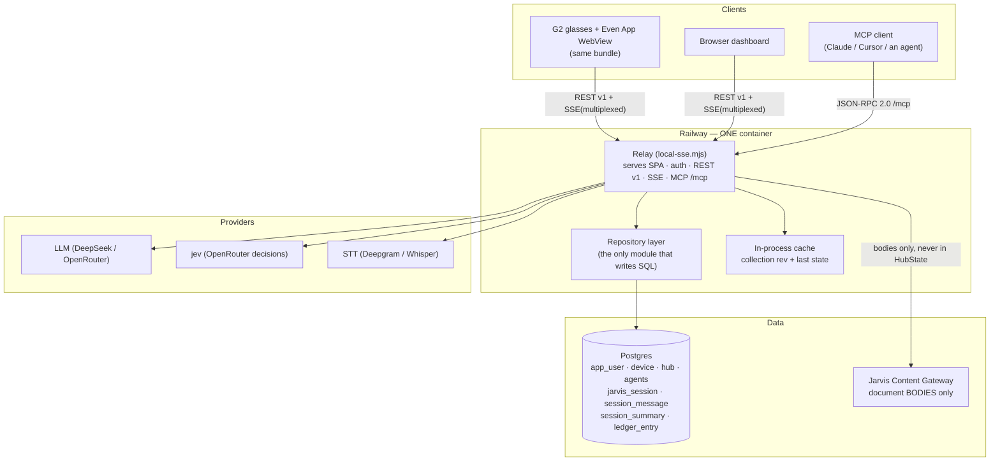
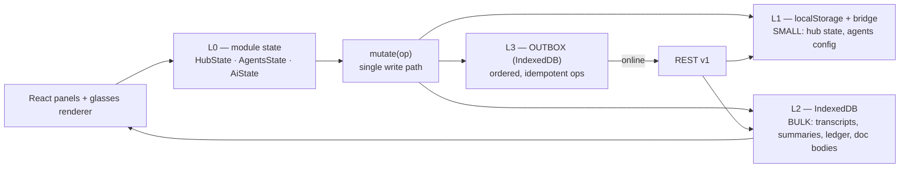

# 00 — Overview: thesis, target architecture, decisions

## 1. What exists today (one page)

The project is one Vite + TypeScript app (`glasses/`) that renders both the G2
glasses display and the companion web dashboard, plus one zero-dependency Node
relay (`web/server/local-sse.mjs`) that serves the bundle and every API on one
origin. Persistence today is spread over **six** places, none of which is a
database:

| # | Store | Lives in | Holds | Survives |
|---|---|---|---|---|
| 1 | Module state | browser/WebView memory | `HubState`, `AgentsState`, `AiState`, ledger, memory | nothing |
| 2 | `window.localStorage` | browser/WebView origin | `hub:docs`, `hub:agents` | reload |
| 3 | Even App bridge store | the phone host | same keys as #2, plus `hub:deviceId`, `hub:owner`, `hub:ai-memory`, `hub:agentSessions` | reload + WebView teardown |
| 4 | `web/.g2-hub-state.json` | relay disk | `{ <channel>: lastState }` for `hub` and `agents` only | relay restart |
| 5 | `web/.g2-hub-auth.json` | relay disk | `{ sessions, devices }` | relay restart |
| 6 | `web/.g2-hub-secrets.json` | relay disk | provider keys, model, `toolTokens` | relay restart |
| 7 | Jarvis Content Gateway | external `167.172.77.136` | HTML documents (bodies only) | externally |

**⚠ LOAD-BEARING asymmetry, and the reason a database is genuinely needed:**
on a real Even App device, only the bridge store (#3) survives; in a browser,
only `localStorage` (#2) does. The dual-write in `durable-docs.ts` /
`durable-agents.ts` exists to paper over that. It works, but it means the truth
about a user's data is *whichever of two stores wrote last on whichever host the
user happened to open*, and the relay's file (#4) is a third opinion.

### What the current design gets right (and must not be lost)

These are not accidents. Each was paid for with a shipped bug, and each carries
forward:

1. **One stream socket.** `GET /api/stream?channels=a,b,c` multiplexes every
   channel over one connection, because browsers cap ~6 HTTP/1.1 sockets per
   origin and an SSE response never releases its socket. One `EventSource` per
   relay base, never one per channel.
2. **Collection-level ordering, not per-item.** `POST /api/stream` refuses a
   write whose `updatedAt` is behind the cached one (`{ok:true,stale:true}`) and
   the client converges **forward** by re-publishing its own copy. This is what
   stops a backgrounded device from clobbering the device the wearer is holding.
3. **Three different merge policies, deliberately.** `todo`/`docs`/`notes` are
   whole-collection replace-with-ordering-guard (**union would resurrect
   deleted items**); `agent sessions` are **union + tombstone + richer-wins**;
   `agents`/`tools`/`llm` are plain last-write-wins.
4. **Tombstones for clears.** `sessionsClearedAt` is the only reason an explicit
   "clear history" survives a union merge.
5. **The ledger is append-only and does not own state.** `HubState` is
   authoritative; the ledger is a superset generated *from* run traffic. No
   update, no delete — a reversal is a new entry with `refs` back to the old one.
6. **Secrets never ride a broadcast channel.** Only `llm.hasKey: boolean` is
   synced; keys stay server-side. `HubState` is broadcast *and* persisted, so
   anything in it is effectively public.
7. **`FileRef` has no body field, and must never gain one.** It is a reference;
   bodies live on the gateway and are fetched on demand.

### What the current design cannot express

| Cannot express | Consequence today |
|---|---|
| An **idempotent operation** | Whole-state POSTs are naturally idempotent, so this never mattered — until writes become row-level. A retried `POST /todos` after a dropped response creates a duplicate. |
| **Partial read** | A client always receives the entire `hub` state; it cannot ask for "todos changed since X". |
| **History** | The last write wins outright. There is no way to see what a doc said before. |
| **Unbounded history** | `MAX_SESSIONS = 5` per agent, `MAX_SESSIONS_TOTAL = 30`. The cap exists because the list is published in full on every edit and persisted verbatim. Session history is a *sync budget*, not a product decision. |
| **Search** | No index over anything. Jarvis cannot answer "what did I ask you about the ferry last month". |
| **A summary distinct from the transcript** | `JarvisMemory.digest` is the closest thing, and it is one blob describing *all* history, not per session. |
| **A server-side MCP surface** | `mcp-tools.mjs` is an MCP **client** (it consumes the Content Gateway). Nothing in this repo is an MCP **server**. |
| **Recall** | `runAiAgent` is deliberately stateless; `memoryMessages()` gives it the newest 6 turns of *one* log. Session selection by relevance does not exist. |

## 2. The thesis

> The relay already is the API server. The blob is the problem, not the server.

So the plan is **not** a new service, a new origin, or a new auth system. It is:

1. Put a **Postgres database behind the relay**, and give the relay a **repository
   layer** so SQL never leaks into the route handlers.
2. **Decompose each channel blob into rows**, carrying every merge rule above
   across verbatim as an explicit, documented, testable policy.
3. Add the **two primitives a blob cannot have**: a per-collection **revision**
   (`rev`) for the control plane, and a client-generated **operation id** for
   idempotency.
4. Add a **layered offline cache** (IndexedDB + the existing localStorage/bridge
   pair) with an **outbox**, so the app is fully readable offline and replays its
   mutations on reconnect.
5. Make **Jarvis sessions a first-class table**, with `AgentSession` and
   `JarvisMemory` becoming *projections of it* rather than two unrelated logs.
6. Expose sessions over **REST** (for the app) **and MCP** (for an LLM), with
   **versioned, append-only summaries** so "refer back to a past session" is an
   index lookup rather than a transcript replay.
7. Use **JEV `rank`** — the primitive `routeTools` already implements — to pick
   which sessions to surface from an STT utterance.

## 3. Target architecture

### Client-side layers (unchanged names, one new tier)

**Rule:** the UI never calls `fetch` directly. It calls `mutate()` (write) or a
cache-first reader (read). That is what makes offline mode a property of the
system rather than a per-feature retrofit.

## 4. Decision log

Each decision is recorded with its alternative and the reason it lost. The full
risk/phase view is in `08-roadmap-and-decisions.md`; these are the load-bearing
ones.

### D1 — Keep exactly one relay; do not split out a "data service"

**Chosen:** the database sits behind `local-sse.mjs`, reached through a new
`web/server/repository/` layer.

**Rejected:** a second service (`data-api`) behind its own hostname.

**Why:** the auth model (`principalFromToken`, `readToken`, `requireOwner` vs
`requirePrincipal`), the CORS allow-list (`Authorization` + `Max-Age: 600`), the
secret store, and the SSE fan-out all live in the relay. A second service means a
second auth implementation, a second CORS surface, and a second deploy — for zero
benefit, because the relay is already stateless-per-request apart from its stores
and already scales horizontally once the state is in Postgres. The only thing a
split would buy is independent scaling of a workload that peaks at a few requests
per second per user.

**Cost accepted:** the relay file grows. Mitigated by the repository layer: route
handlers get `repos.hub.get(principal)` instead of reaching into `channels`.

### D2 — Postgres is the target; the JSON state file becomes a cold cache

**Chosen:** Postgres (Railway's managed add-on), with the SQL confined to
`web/server/repository/*.mjs`. A SQLite adapter is *allowed* behind the same port
for tests and local dev, but is not required to ship.

**Rejected:** keep JSON files, add `node:sqlite`.

**Why:** the file is rewritten in full on every state change (`persistState`
serialises every channel), which is `O(total data)` per keystroke-batch, and it
is why the session list has to be capped. Postgres gives partial reads, indexes,
JSONB for the parts that are genuinely schemaless (`args`, `payload`), and
transactional multi-row writes — which are what make row-level operations safe.

**⚠ Migration hard rule:** while both exist, the file is a **write-through
cache**, never an authority. `loadPersistedState()` must not be allowed to
resurrect a row the database has deleted. During the dual-run phase the file is
read only when the database reports zero rows for a user (first boot after
deploy).

### D3 — Two-tier sync: `rev` for control, `updatedAt` for display

**Chosen:**

- **Control plane:** every collection has a monotonic `rev` (bigint, bumped
  inside the same transaction as any write). Clients send `baseRev`; a mismatch
  is a `409` carrying the current value. This is the generalisation of the
  existing `stale:true` refusal.
- **Data plane:** per-item `updated_at` orders lists for humans. It is **never**
  the merge key for `todo`/`docs`/`notes`.

**Rejected:** per-item last-write-wins everywhere (the "obvious" SQL design).

**Why:** the whole-collection ordering guard is load-bearing. Per-item LWW
silently accepts out-of-order writes from a backgrounded device, because each
item's clock looks newer in isolation. The guard works precisely because a
device that has been asleep has an *older collection stamp* than the collection
it is trying to overwrite, and the comparison is made against the collection,
not the item.

**Cost accepted:** a full-collection replace is coarser than a PATCH. Mitigated
by accepting both: PATCH for single-item edits (the common case, and it carries
`baseRev`), bulk PUT for a client that has been offline and is re-sending a
coherent snapshot.

### D4 — Four cache tiers, chosen per data class by size and by who needs it before first paint

**Chosen:** L0 module state (exists) → L1 `localStorage` **+** the Even App bridge
(kept, for small things needed synchronously) → L2 **IndexedDB** (new; bulk) →
L3 **outbox** (new; IndexedDB, separate store).

**Rejected:** put everything in IndexedDB and delete the bridge dual-write.

**Why:** the bridge store is the only thing that survives a WebView teardown on a
real device, and `main.ts` needs `HubState` *synchronously* at boot to create the
startup page. IndexedDB is asynchronous, so booting the glasses renderer from it
would mean either a blank first frame or a reordering of `createStartUpPageContainer`
(one-shot) against the first `textContainerUpgrade`. So: small + synchronous stays
in L1; bulk + async moves to L2.

### D5 — Cache-first reads in the app; service worker only for the shell

**Chosen:** every read goes through an app-level reader that returns cached data
immediately with `{ fresh: false, ageMs }`, then revalidates. A service worker
caches only the static shell (`index.html`, hashed JS/CSS, icon).

**Rejected:** a service worker that intercepts `/api/*` with
stale-while-revalidate.

**Why:** service-worker support inside the Even App WebView is not guaranteed,
and a SW is a *second, invisible* cache with its own invalidation rules. Two
caches with independent invalidation is how you get a UI that shows a deleted
todo forever. The app-level cache is testable in Node (every harness in
`glasses/tools/` runs without a browser), and it is the same code path on both
hosts.

### D6 — One canonical `jarvis_session` table; the two existing logs become projections

**Chosen:** `jarvis_session` + `session_message` is the only session store.
`AgentSession` and `JarvisMemory` are read models over it:

- an `AgentSession` → a row with `kind = 'agent'` and `agent_id` set
- `JarvisMemory.turns` → rows with `kind = 'voice'` (or attached to the run they
  belong to)
- `JarvisMemory.digest` → a row in `session_summary`, **versioned**

**Rejected:** keep `JarvisMemory` as its own table.

**Why:** they are the same thing — a chronological record of exchanges with the
wearer — and keeping them apart is exactly why "what did I ask you last month"
is unanswerable today. The digest is *a summary of a subset of sessions*, which
is precisely what `session_summary` is for. One store, and the existing
word-char budget logic in `memory.ts` becomes a **retention policy over rows**
instead of a reason to lose history.

### D7 — `rankItems` is one primitive, used three ways

**Chosen:** extract the body of `routeTools` into `rankItems({ ask, candidates,
top, respond })`. `routeTools` becomes a thin adapter over it (`catalogue` →
candidates). Session recall calls it directly.

**Rejected:** a separate, session-specific ranking implementation.

**Why:** `routeTools` already solves the hard parts — label building
(`routeLabels`), spec construction (`buildRouteSpec`), the `MAX_CANDIDATES = 12`
ceiling, the label-vs-index keying trap, and **failing open in eight distinct
ways**. Writing a second ranker means re-deriving all of that and getting the
failure modes wrong in a new place. One primitive means one set of trap tests
(see `07-jev-recall.md`).

### D8 — Refused designs

Listed here, argued in `08-roadmap-and-decisions.md` § "What I would refuse to
build":

- a CRDT / Automerge sync engine
- union-merge for `todo` (or `docs`, or `notes`)
- storing `FileRef` bodies
- an LLM/provider key in the client bundle
- embeddings-only retrieval (no FTS)
- sharing one token between the phone, the browser and an MCP client
- unbounded sessions on the **broadcast** path (`agents` channel stays capped)
- a second source of truth for a summary (a summary is derived, and derived data
  is never edited in place)

### D9 — Compatibility envelope is preserved

**Chosen:** every response keeps the existing `{ ok: true, ... }` /
`{ ok: false, error, code }` shape, and the `{ ok, text, state? }` tool contract
where `state` is present **only when something actually changed**. New concerns
are additive: `rev`, `ETag`/`If-Match`, `Idempotency-Key`.

**Why:** the client bundle and the relay are deployed independently by design —
`/app.json` and the SPA can be at different versions during a rollout, and the
Even App caches the bundle. An additive envelope means an old bundle keeps
working against a new relay (it ignores unknown fields) and a new bundle
degrades gracefully against an old relay (`rev` missing → behave as today).

### D10 — MCP gets its own scoped credential

**Chosen:** a `mcp_token` table with `scopes text[]`, separate from
`auth_session` (owner 48-hex token) and `device` (UUID).

**Rejected:** reuse the owner session token for `/mcp`.

**Why:** an MCP server is driven by LLM tooling, which is a different trust
boundary from the phone in the wearer's pocket. Sharing the token means a
misbehaving MCP client has the wearer's full session: settings, secrets write,
device revocation. Scopes let it be narrowed to `sessions:read`,
`sessions:write`, `memory:read`, `recall` — which is also what makes the
"LLM refers back to past sessions" story defensible.

### D11 — A refused write is a signal to converge, not an error

**Chosen:** on `409 stale` the client MUST (a) adopt the server value, (b)
replay its own pending outbox entries **on top of** it, (c) resubmit. Same
direction as `store.ts`'s `applyRemote` today.

**Why:** the current code already does this and it is the reason a brief
two-device disagreement resolves instead of deadlocking. Making it explicit in
the API contract (rather than an informal consequence of the client's reducer)
means a third client cannot accidentally implement "last writer wins" and
resurrect a delete.

## 5. Non-goals

- **Multi-user / sharing.** Every table is keyed by `user_id` for correctness,
  but nothing in this set designs collaboration. One wearer, many devices.
- **Real-time collaborative editing.** Docs are single-writer-at-a-time, guarded
  by `rev`. No OT, no per-character merge.
- **Versioned document history for `docs`** (the wearer's own library). The
  *gateway* documents already have revisions (`list_revisions` /
  `read_revision` / `restore_revision`); duplicating that locally is scope creep.
  Only `jarvis_session` and `ledger_entry` get local history, and `session_summary`
  is versioned because re-summarisation must not destroy the previous summary.
- **Changing the glasses render path.** `HubState` stays the render contract; the
  renderer keeps reading a whole `HubState` object. This set changes where it
  comes *from*, not its shape.
- **Bumping the app version or shipping any of this.** Separate decision, and the
  version is the user's to set.
