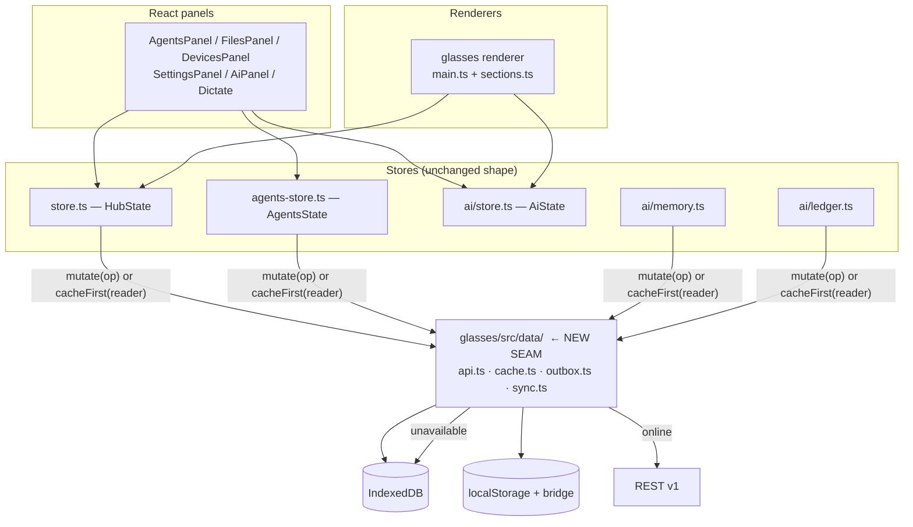

# 04 — Web app integration

How the existing SPA (React panels + the glasses renderer) consumes the v1 API,
and what happens to each thing it does today.

## 1. What the app is today, structurally

| Layer | Module | Role |
|---|---|---|
| Render target A | `glasses/src/main.ts` + `sections.ts` | draws to the G2; owns the event loop |
| Render target B | `glasses/src/web/*.tsx` | the dashboard in a browser |
| Shared state | `glasses/src/store.ts`, `agents-store.ts`, `ai/store.ts`, `ai/memory.ts`, `ai/ledger.ts`, `agent-runs.ts` | module singletons + `useSyncExternalStore` |
| Transport | `glasses/src/stream.ts`, `web/*-client.ts` | fetch + one `EventSource` per base |
| Durability | `durable-docs.ts`, `durable-agents.ts` | the dual write |

**The integration rule for everything below:** this module structure does not
change shape. `store.ts` keeps owning `HubState`; the panels keep subscribing with
`useSyncExternalStore`; `main.ts` keeps reading a whole `HubState` to draw. What
changes is **where the bytes come from** and **where a mutation goes**.

That is deliberate: a rewrite of the state layer would touch the glasses event
loop and the 999-byte frame budget, which is the least testable part of the
codebase (`main.ts` is 86 KB and has no harness).

## 2. The new seam: one write path, one read path



A new directory `glasses/src/data/` holds the seam. Nothing outside it may call
`fetch` for persistent data.

| Module | Responsibility |
|---|---|
| `data/api.ts` | typed wrappers over `/api/v1`, `Idempotency-Key` generation, the `{ok,code}` envelope, the 401-only-if-credential-sent rule |
| `data/cache.ts` | L1/L2 read + write, staleness metadata, eviction |
| `data/outbox.ts` | the ordered op queue in IndexedDB |
| `data/sync.ts` | pull/push orchestration, backoff, the converge-forward rule |
| `data/policy.ts` | **the merge policies as pure functions** (see §6) |

`data/policy.ts` is the important one. The three merge policies currently live
inside `agents-store.applyRemoteAgents`, `types.mergeSessions` and the relay's
`POST /api/stream` guard — three places, two languages. Extracting them as pure
functions means one implementation, testable in Node, used by both the client and
(translated) the repository.

## 3. Mutating: replacing every direct store write

Today a panel does roughly:

```ts
updateAgents((s) => ({ ...s, agents: [...s.agents, next] }));  // agents-store.ts
```

and `updateAgents` persists to `localStorage`, mirrors to the bridge, debounces
250 ms, and publishes the whole blob to the relay. The glasses' todo/docs/notes
writes go the same way through `store.ts`.

**New contract — a mutation is an operation, not a reducer call:**

```ts
// glasses/src/data/outbox.ts
export interface Op {
  opId: string;              // uuid v4 — THE idempotency key
  at: number;                // client clock; display ordering only
  collection: Collection;    // 'todo'|'docs'|'notes'|'agents'|'tools'|'sessions'|'ledger'|'memory'
  action: OpAction;          // 'create'|'update'|'delete'|'replace'|'append'|'clear'|'reorder'
  targetId?: string;
  baseRev?: number;          // what the client believed
  payload: unknown;
}

/** The ONLY way a persistent change happens. */
export function mutate(op: Omit<Op, 'opId' | 'at'>): void;
```

`mutate()` then, synchronously:

1. **Applies the reducer locally** (`store.ts` / `agents-store.ts` as today), so
   the glasses repaint on the next frame with no network delay. **This is
   mandatory** — the wearer's tap must not wait for a round trip.
2. Writes the resulting state to L1 (`localStorage` + the bridge mirror, for the
   small collections) or L2 (IndexedDB, for bulk). **Keep the dual-write**; a
   real device survives only via the bridge.
3. Enqueues the op in the outbox (L3).
4. Fires the flush, which coalesces via the existing 250 ms debounce.

> **⚠ The debounce stays, and it gets a second job.** It currently stops a
> keystroke-per-frame from POSTing a whole blob. With ops, it coalesces a burst
> into one `POST /sync/push` **with `ops: [...]`** — which is why the push
> endpoint takes an array. A `todo.edit` per character would otherwise be a
> request per character.
>
> **⚠ Coalescing must not reorder.** Two ops on the same `targetId` may collapse
> (last `update` wins); two ops on different targets may not. A `delete`
> followed by an `update` must **not** collapse — the delete goes first and the
> update is dropped as a write to a deleted row. `outbox.coalesce()` implements
> exactly this and is a pure function so it can be tested with fixtures.

### Collection → policy map (the client half)

| Collection | Local apply | Cache tier | Ops |
|---|---|---|---|
| hub scalars | `store.ts` | L1 | `update` |
| `todo` | `store.ts` | L1 | `replace`, `create`, `update`, `delete`, `reorder` |
| `docs` (list) | `store.ts` | L1 (titles + ids) | `create`, `delete`, `reorder` |
| `docs` (content) | `store.ts` | **L2** | `update` (with `If-Match`) |
| `notes` | `store.ts` | L1 | `replace`, `append` |
| `files` | `store.ts` | L1 | `create`, `delete` |
| `agents` / `tools` / `llm` | `agents-store.ts` | L1 (both stores) | `replace`, `create`, `update`, `delete` |
| `sessions` | `agents-store.ts` + `agent-runs.ts` | **L2** | `create`, `append`, `update`, `clear` |
| `memory` | `ai/memory.ts` | L1 (`hub:ai-memory`) + L2 turns | `append`, `replace` |
| `ledger` | `ai/ledger.ts` | **L2** | `append` only |

**Why ledger and sessions move to L2 and hub state does not:** `HubState` must be
readable **synchronously at boot** (the glasses renderer creates its startup page
once, and `textContainerUpgrade` ordering against `createStartUpPageContainer` is
not reorderable). IndexedDB is async, so putting hub state there means either a
blank first frame or a race with page creation. Sessions and the ledger have no
such constraint — nothing draws them on frame one.

## 4. Reading: SSE stays, REST is added

**Recommendation: keep `GET /api/stream` and do not replace it with polling.**

The reasoning, in order of weight:

1. **SSE is the correct primitive for the one thing that needs push.** The relay
   already fan-outs `hub` and `agents` to every device, and a run executes
   *server-side* precisely so it survives the glasses being backgrounded. Push is
   load-bearing for that. Replacing it with polling turns a backgrounded run into
   a poll loop on a phone radio.
2. **Multiplexing already solved the socket problem.** `?channels=a,b,c` over one
   `EventSource`, with a per-frame `channel` tag. The 6-socket Chrome limit is
   why this exists and it is already correct.
3. **Nothing about moving to a database changes the push requirement.** The
   *write* path is what becomes op-based; the *read* path stays a fan-out.

What changes:

| Today | New |
|---|---|
| `POST /api/stream` with a whole state blob | `POST /sync/push` with ops. The POST route stays until Phase C, then is deprecated. |
| The relay's `channel.lastState` **is** the state | `channel.lastState` becomes a **cache of `repos.hub.get()`**, invalidated by `rev` |
| `TRANSIENT_CHANNELS = Set(['ai','ai-ctl'])` | **unchanged, and must stay** |
| Channel frames carry `state` | unchanged — the frame shape is frozen |

> **⚠ The `TRANSIENT_CHANNELS` guard must survive the refactor.** A transient
> frame cached in `channel.lastState` replays as the next client's `init`. That
> *is* the shipped 0.3.24 "Jarvis killed itself" bug: a client connected, read a
> resurrected `ai` frame as its initial state, and immediately acted on a stale
> run. Three call sites enforce the skip today — `loadPersistedState`,
> `persistState`, and the `channel.lastState` cache write in `send`. All three
> must keep it, and a test must assert that a frame on `ai` never lands in
> `lastState`.

### 4.1 The boot sequence (glasses path, in order — the order is load-bearing)

```
1. loadOwnerSession()            → bridge/localStorage, SYNC-ish, awaited before any fetch
2. read L1 hub:docs              → HubState for the FIRST paint of the menu
3. createStartUpPageContainer    → ONE shot; must not be in a loop with step 4
4. read L1 hub:ai-memory         → memory prompt block
5. connect ONE EventSource       → /api/stream?channels=hub,agents,ai,ai-ctl&token=…
6. on `init`/`state`             → store.applyRemote(...)  [converge forward]
7. background: sync.pull()       → reconcile anything missed while offline
8. background: outbox.flush()    → replay anything mutated while offline
```

**Step 3 before step 5, always.** `createStartUpPageContainer` can only be called
once; if it waits on the socket the user stares at a blank display, and if it is
called again after a state arrives the firmware rejects it.

**Step 7/8 are backgrounded on purpose.** The first frame must not depend on a
network round trip, or the app is unusable with no signal — which is the entire
point of the offline work.

### 4.2 Cache-first reads

Every panel read goes through:

```ts
// glasses/src/data/cache.ts
export interface Cached<T> { value: T; fresh: boolean; ageMs: number; rev: number }
export function cacheFirst<T>(key: string, fetcher: () => Promise<T>): Cached<T>;
```

It returns L2/L1 immediately, then revalidates and calls back. Panels render the
stale value with no spinner; a small "synced 4m ago" indicator in the header
tells the truth. **`fresh: false` must be visible somewhere**, or an offline app
that looks online produces silent data loss from the user's perspective.

### 4.3 What each panel needs

| Panel | Endpoints | Cache tier | Notes |
|---|---|---|---|
| `AgentsPanel` | `/agents`, `/tools`, `/sessions?agentId=` | L1 (config) + L2 (sessions) | Session list is paginated now — it is no longer capped at 5 |
| `AiPanel` | `/sessions`, `/ledger` (optional) | L2 | The live run still rides `agent-runs.ts` + SSE; only the *finished* transcript is persisted |
| `FilesPanel` | `/files`, `/files/:id/text`, `/files/:id/revisions` | L2 (bodies on demand) | Bodies are never cached wholesale — see §5 |
| `SettingsPanel` | `/settings`, `/settings/secrets` | L1 | Secrets stay write-only |
| `DevicesPanel` | `/devices`, `/pair/*` | none (server-authoritative) | Must never be served from cache: showing a revoked device as active is a security-shaped lie |
| `Dictate` | `/stt` + `/recall` | none | Real-time |
| Todo/Docs/Notes (glasses) | `/hub`, `/todos`, `/docs`, `/notes` | L1 (+ L2 for content) | |

## 5. Caching policy for the large things

| Data | Cache? | Why |
|---|---|---|
| `HubState` (no doc content) | **always, L1** | needed for the first frame |
| `document.content` | **L2, LRU, 20 docs / 2 MB** | bulk, and only the doc being read is needed |
| `session_message` | **L2, per session, opt-in** | a transcript is the largest object; caching all of them is how the old design justified capping at 5 |
| `session_summary` | **L2, all of them** | small, and they are what a list/search view renders |
| `ledger_entry` | **L2, last 400** | matches `MAX_ENTRIES`; older entries are a debug affordance |
| `memory_turn` | **L2, last 200** | matches `MEMORY_KEEP_TURNS` + the prompt window |
| `file_ref` | **L1** | references only, tiny |
| `file` **bodies** | **never cache wholesale** | up to 4 MiB each on an external service. Cache the last 3 opened, in L2, with an explicit TTL, and mark them evictable first |
| `AgentRun` live | memory only | transient by design |
| `AiState` | memory only | transient by design |

**Eviction order under quota pressure:** file bodies → document content (LRU) →
session messages → ledger → nothing in L1, ever. L1 is the boot path and is
exempt.

## 6. The merge policies, as shared pure functions

`data/policy.ts` exports exactly the three rules from `01-inventory.md` §3, with
the same names and the same semantics:

```ts
export function mergeSessions(local: AgentSession[], incoming: AgentSession[],
                              clearedAt: Record<string, number>): AgentSession[];
export function mergeClearedAt(a: Record<string, number>,
                               b: Record<string, number>): Record<string, number>;
export function embraceNewer<T extends { updatedAt: number }>(local: T, incoming: T): T;
```

These already exist in `types.ts` and are already imported by `agents-store.ts`
and the relay. The change is that they become the **only** implementation, that
the repository uses the SQL equivalents, and that a single fixture set
(`glasses/tools/policy-sim.mjs`) pins all three against both.

> **⚠ `mergeSessions`'s comparison direction is the whole fix** (see
> `01-inventory.md` §3). Incoming wins unless it is **strictly** poorer
> (`>=` on the incoming side). Flipping it to `>` on the local side breaks
> backdating and corrections — it made the monitor harness's backdated fixtures a
> silent no-op, which is the worst kind of bug: the tests passed and the feature
> did nothing.

## 7. Rollout: a flag, not a fork

`glasses/src/data/index.ts` exposes:

```ts
export const DATA_BACKEND: 'stream' | 'v1' =
  (import.meta.env.VITE_DATA_BACKEND as 'stream' | 'v1' | undefined) ?? 'stream';
```

- Default **`'stream'`**: byte-identical behaviour to today.
- `'v1'` in `.env.local` (and later in the build) opts in.
- Both paths are live in one bundle, so a rollback is an env change and a
  redeploy — not a revert of the state layer while the glasses are mid-session.

Phase C flips the default. The old path is deleted one release later, when the
deployed `/app.json` version is newer than the version that first shipped `v1`
(`03-rest-api-spec.md` §9).

**A device may never be half-migrated.** `DATA_BACKEND` is read once at boot and
stored on `HubState`-adjacent module state; a mid-session flip would leave the
outbox holding ops the stream path knows nothing about. If a flip is detected on
a later boot, the outbox is flushed **before** the stream path is allowed to
publish.

## 8. What must not change in the web layer

Collected, because these are the things an integration refactor breaks by
accident:

- **One `EventSource` per relay base**, never one per channel.
- `AGENTS_STREAM_URL`'s fallback is derived from `API_BASE`, **not** the bare
  same-origin path. A locally-built bundle served from a dev server or a
  `file://` WebView would otherwise subscribe to the agents channel on the wrong
  origin while publishing hub state to the right one, and agents would silently
  never sync between browser and glasses.
- `TRANSIENT_CHANNELS` skip in all three places.
- The backwards-sync guard, and `{ ok: true, stale: true }` as its reply shape.
- `{ ok, text, state? }` with `state` present **only** when something changed.
- The dual-write to the bridge; a real device survives only via it.
- `CapabilityResult.summary` stays one short emoji-free line.
- `applyRemote` keeps the converge-**forward** branch, now expressed against `rev`.
- Panels keep `useSyncExternalStore`; a `useEffect` + `useState` cache would
  re-render the glasses HUD on every `AiStep`, and `MAX_STEPS_KEPT = 60` makes
  that a visible stutter.
- `settings-patch.ts` stays pure. Its `always` / `ifSet` / `touched` three-way
  discipline is what makes a blank field mean "clear" in one place and "leave
  alone" in another, and moving a DOM read into it silently changes the meaning of
  every settings save.
