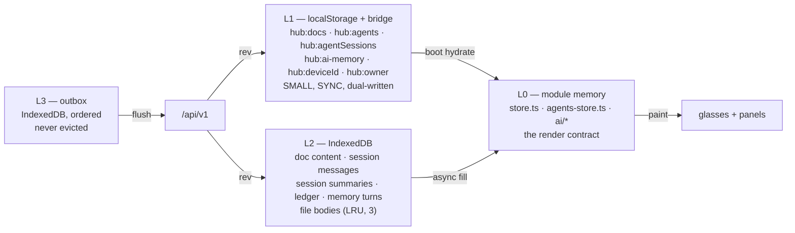

# 05 — Offline cache and sync

The offline requirement, stated precisely: **the app must be fully usable with no
network, and any change made offline must reach the server exactly once when the
network returns.** "Usable" means: open the app, read the todos, read the notes,
read a document that was cached, and edit any of them — on the glasses and in the
browser.

This document is the client half. The server half is `03-rest-api-spec.md` §5.10
and the tables in `02-database-spec.md` §10.

## 1. Why four tiers

Three constraints, each of which rules out a tier:

| Constraint | Consequence |
|---|---|
| Hub state must be readable **synchronously** at boot, before the first frame | rules out IndexedDB as the only store (async) |
| Documents, transcripts and file bodies are multi-KB to multi-MB | rules out `localStorage` as the only store (5 MB, sync, string-only) |
| A mutation made offline must survive a restart **and** be replayable in order | rules out "just keep it in memory" |

So:



**L3 is deliberately its own store, not a field on L2.** If pending ops shared a
store with cached data, an eviction pass (or a "clear cache" button, or a quota
error) could destroy unsent work. The outbox is the one thing in the client that
is never evicted, never expired, and never cleared except by a flush that got a
definitive server answer.

## 2. L1 — schema, and why the keys stay the same

The existing keys are kept verbatim. Re-keying means every installed app boots
with no state.

| Key | Value | Migrated from |
|---|---|---|
| `hub:docs` | `{ hub: HubState, rev: number, cacheAt: number }` | bare `HubState` |
| `hub:agents` | `{ state: AgentsStateMinusSessions, rev, cacheAt }` | bare `AgentsState` |
| `hub:agentSessions` | `{ sessions: AgentSession[], clearedAt, rev, cacheAt }` | bare array |
| `hub:ai-memory` | `{ memory: JarvisMemory, rev, cacheAt }` | bare `JarvisMemory` |
| `hub:deviceId` / `hub:owner` | unchanged | — |

**The migration is tolerant, not versioned.** `readL1()` accepts both shapes: if
the parsed value has the key it wants (`hub` / `state` / `sessions`) it is the new
shape; otherwise the value *is* the old shape and `rev = 0, cacheAt = 0`. That is
~15 lines and it means an update never strands a device's state. A formal
`schemaVersion` would be more correct and would also be more code for a
single-user app.

> **⚠ Keep the dual write to `bridge.setLocalStorage`, and keep it on every
> write — not just at shutdown.** On the real Even App only the bridge store
> survives a restart; in the simulator the opposite is true. There is no runtime
> detection that is reliable for this, so both are written every time. This is
> already the shipped behaviour (`durable-docs.ts`) and it is the single most
> important durability line in the codebase.

> **⚠ L1 has a hard size ceiling and the new `rev`/`cacheAt` must not push it
> over.** `hub:docs` holds **document content too** today (a `DocEntry` carries
> `content`). With unbounded `content` (`02-database-spec.md` §4) a few long
> documents will blow the ~5 MB quota, and a `quotaExceededError` on the boot key
> is a boot failure.
>
> **Therefore: L1 stores `DocEntry[]` with `content` stripped, and content lives
> in L2.** The in-memory `HubState` still has it (so the renderer is unchanged),
> but the persisted copy does not. `hydrateDocs()` merges L1 titles with L2
> content on boot. This is the one place where the L1 shape and the in-memory
> shape intentionally differ, and it must be asserted in a test: a `hub:docs`
> entry with a non-empty `content` is a bug.

## 3. L3 — the outbox

### 3.1 Shape

```ts
export interface Op {
  opId: string;              // uuid v4 — also Idempotency-Key
  at: number;                // client clock, display ordering only
  collection: 'todo'|'docs'|'notes'|'files'|'agents'|'tools'|'settings'
            |'sessions'|'memory'|'ledger'|'hub';
  action: 'create'|'update'|'delete'|'replace'|'append'|'clear'|'reorder';
  targetId?: string;
  baseRev?: number;
  ifMatch?: string;          // document ETag for content writes
  payload: unknown;
  attempts: number;
  lastError?: string;
  retryAt?: number;          // set by 429 / 5xx backoff
}
```

### 3.2 IndexedDB layout

```
outbox        keyPath 'opId'      index 'at'                 // the queue
cacheDocs     keyPath 'id'        value { id, content, rev, cacheAt, bytes }
cacheSessions keyPath 'id'        value { id, meta, messages?, summaries, rev, cacheAt }
cacheLedger   keyPath 'seq'       index 'at'
cacheMemory   keyPath 'id'        index 'at'
cacheFiles    keyPath 'id'        value { id, title, text?, revisions?, cacheAt, bytes, openCount }
meta          keyPath 'key'       // { key:'lastRev'|'lastSeq'|'lastPullAt'|'cacheSchema' }
```

`meta.cacheSchema` is a version int here — unlike L1, L2 *is* versioned, because a
shape change in an IndexedDB store is an `onupgradeneeded` and guessing is worse
than rebuilding. Bumping it drops the cache; it never touches the outbox.

### 3.3 Ordering

**Two rules:**

1. **FIFO across the whole queue.** Ops are flushed in `at` order. Strict
   per-collection queues would allow a `docs` create and a `docs delete` to be
   flushed concurrently and land out of order; a single queue cannot.
2. **Dependencies are explicit, not inferred.** An op may carry
   `dependsOn: string[]` (op ids). A `todo.update` for an item created offline
   depends on the create. The flusher processes the batch but holds any op whose
   dependencies are not yet `applied` **in this same batch**. Without this, a
   create+update pair sent in one `POST /sync/push` can be applied in the order
   the server happens to iterate, and the update hits a row that does not exist
   yet.

**Within one op, the op is atomic.** The server applies each op in its own
transaction (`02-database-spec.md` §10) so a batch is a sequence of atomic
applications, not one transaction. That is a deliberate trade: a partial batch is
far more useful than an all-or-nothing batch, because the client gets per-op
results and can retry only the failures.

### 3.4 Coalescing (and what must not coalesce)

`outbox.coalesce(ops: Op[]): Op[]` — pure, exported, fixture-tested.

| Pair | Result |
|---|---|
| `update(a) , update(a)` | one `update(a)` with the later payload |
| `update(a) , delete(a)` | one `delete(a)` |
| `delete(a) , update(a)` | **both kept** — the update is dropped at flush time as a write to a deleted row, and dropping it in `coalesce` would silently swallow a legitimate recreate |
| `create(a) , update(a)` | `create(a)` with the later payload |
| `reorder(x) , reorder(x)` | one, last wins |
| `append(notes) , append(notes)` | **never merged** — two appends are two facts; they become one `POST /sync/push` with two ops, in order |
| anything on different `targetId` | never merged |
| anything across a `ifMatch` boundary | never merged — the guard belongs to one specific server revision |

> **⚠ The `append` rule is the one that gets "optimised" wrongly.** Concatenating
> two appends and sending one is correct in content and wrong in intent: the
> server's `updated_at`, the ledger, and any `Idempotency-Key` retry granularity
> all lose a boundary. If the concatenated op is retried after a partial failure,
> both user actions are re-applied as one.

### 3.5 Flush

```
flush():
  if (inflight) return                                  // single-flight
  if (now < nextFlushAt) return                         // 429 / 5xx backoff
  batch = await outbox.takeBatch(limit = 50)            // by 'at', skipping retryAt > now
  batch = coalesce(batch)
  if (!batch.length) return
  res = await api.push(batch)                           // POST /sync/push
  apply per-op results:
    applied    → delete from outbox, adopt returned rev
    duplicate  → delete from outbox  (server already had it)
    rejected   → converge-forward (§4.3) and re-queue with attempts+1
  if (any rejected with STALE_REV) nextFlushAt = now + 0  // immediate re-flush
  if (429) nextFlushAt = now + Retry-After
  if (5xx or network) nextFlushAt = now + backoff(attempts)   // 1s,2s,4s,8s,30s cap
```

**Triggers for a flush:** app boot (step 8), the `online` event, a `visibilitychange`
to visible, a successful SSE `onhandshake`, and 250 ms after any `mutate()`.
`visibilitychange` matters more than `online` on a phone — the browser fires
`online` unreliably after a screen-off, but it always fires `visibilitychange` on
resume.

**`attempts` is capped at 6 and a capped op is never dropped.** It is parked
(`retryAt = Infinity`) and surfaced in the settings panel as "N changes could not
be synced" with a manual retry. Silently dropping a user's edit is the one
outcome that is worse than a stuck queue.

## 4. Conflict resolution

### 4.1 The three cases

| Situation | Rule | Where |
|---|---|---|
| same entity, both changed, no tombstones | **local intent wins for fields the user touched**, remote wins for the rest | per-op, `converge-forward` |
| entity deleted on one side, edited on the other | **delete wins** for `docs`/`todo`/`files`; **union** for `sessions` | server, per `mergeSessions` |
| collection replace (`todo`, `notes`, `docs` list) | **the newer `rev` wins, wholesale — never a union** | server + client |

### 4.2 Why sessions are the exception

Sessions union because a transcript is append-only and monotonic: two devices
accumulating messages is genuinely additive, and `UNIQUE (session_id, seq)`
(`02-database-spec.md` §6) makes the union idempotent. A todo list is not that —
union resurrects deletions.

### 4.3 The converge-forward algorithm (client side)

On `409 STALE_REV` / `412`:

```
1. Adopt details.current into L0 + L1/L2.
2. Re-derive the op's payload against the NEW base:
     - 'update'  → the op's own fields, re-applied onto the new object
     - 'delete'  → unchanged (deletes are rev-independent once the row exists)
     - 'replace' → DROP. A replace built against a base the server has moved past
                   is not the user's current intent any more; the client asks the
                   user instead of guessing.
     - 'append'  → unchanged (append is base-independent by construction)
3. Re-queue with the fresh baseRev; attempts+1.
4. attempts >= 2 → park, notify, leave the server value.
```

**Why step 2 drops a `replace` and retries an `update`:** an `update` names the
fields the user changed, so re-applying it on a newer base is exactly right. A
`replace` names *every* field, so re-applying it on a newer base overwrites a
change the other device just made — which is precisely the bug the `rev` exists to
prevent. Treating them the same is the single most common sync-engine mistake.

### 4.4 The `replace`-means-replace corollary

`GET /sync/pull` returns complete arrays for `todo`, `docs` and `notes`
(`03-rest-api-spec.md` §5.10). The client **substitutes** them. A client that
merges them is a client that resurrects deletions, and it will look correct in
every single-device test.

## 5. `/sync/prime` — the first-run and full-repair path

`GET /sync/pull?since=0` is not a prime: it returns refs and no content, by
design, because content is the bulk. A fresh install therefore needs:

`POST /sync/prime` → a budgeted, streamed snapshot:

```jsonc
{ "include": ["hub", "docs:content", "sessions:summaries", "memory", "agents"],
  "maxDocs": 40, "maxBytes": 3_000_000 }
→ { ok: true, rev, hub, docs:[DocEntry with content], summaries:[…], memory, agents,
    omitted: { docs: 2, sessionMessages: true }, bytes: 2_841_002, serverTime }
```

Rules:

- **Budgeted server-side.** `maxBytes` is honoured; the response sets `omitted`
  and the client shows "2 documents not downloaded". A prime that can be 50 MB is
  a prime that fails on a phone.
- **Never includes file bodies.** They are on an external service with a 4 MiB
  cap each; the prime returns `file_ref` rows only.
- **Never includes session messages** unless `include` asks for it, because the
  message count is the unbounded dimension.
- **Idempotent and re-runnable.** A prime is a read; it never writes.
- **Interruptible.** The client stores what arrived and the client's
  `meta.lastRev` is only advanced on a complete prime, so a partial prime is
  repaired by `pull`, not by re-priming.

`/sync/prime` is also the **repair** path: an L2 cache-schema bump, a corrupt
store, or a device that has been offline for a month all resolve to "prime again"
rather than to a pile of special cases.

## 6. Reconnect detection and the "am I actually current" question

Three signals, and the app must not trust any one alone:

| Signal | Used for | Weakness |
|---|---|---|
| `navigator.onLine` | nothing on its own | reports a captive portal as online |
| `online` event | trigger a flush | unreliable after screen-off on iOS |
| SSE `onhandshake` | the authoritative "connected" signal | only exists while the stream is up |

**Rule: a successful SSE handshake is the only thing that sets `synced = true`.**
`navigator.onLine` may set `possiblyOnline` to trigger an attempt, but the UI
indicator flips to "synced" only after a handshake or a successful
`/sync/push` | `/sync/pull`.

On handshake:

```
pull(since = meta.lastRev)   → apply per §4
flush()                      → §3.5
```

**Pull before flush, always.** Flushing first sends ops with a `baseRev` the
client already knows is stale, wasting the batch on 409s. Pulling first lets the
flush carry a current base.

## 7. Storage budget and eviction

| Store | Budget | On exceed |
|---|---|---|
| L1 (`localStorage` + bridge) | ~4 MB shared, target < 1 MB | **never auto-evict**; the boot key is exempt; a warning is logged |
| L2 `cacheDocs` | 20 docs / 2 MB | LRU by `cacheAt`, pinned if the doc is `activeDocId` |
| L2 `cacheSessions` | 30 sessions / 4 MB of messages | LRU by `cacheAt`; summaries are never evicted |
| L2 `cacheFiles` | 3 bodies / 8 MB | LRU by `openCount` then `cacheAt` |
| L2 `cacheLedger` | 400 rows | ring |
| L2 `cacheMemory` | 200 turns | ring |
| L3 outbox | **unbounded** | never evicted |

`navigator.storage.estimate()` is checked after every write that grew a store by
more than 100 KB; if `usage/quota > 0.9`, the eviction ladder in
`04-web-integration.md` §5 runs immediately rather than waiting for a
`QuotaExceededError`.

**A `QuotaExceededError` on an L1 key is a special case and must be handled
loudly.** It means the boot path is at risk. The handler: strip `content` from
`hub:docs` (which should already be stripped — see §2), retry once, and if it
still fails, drop `hub:agentSessions` from L1 and leave it in L2. Session history
is the only L1 payload that is also fully present in L2, so it is the only safe
thing to sacrifice.

## 8. Multi-device coherence

Two devices, one account. What is guaranteed:

- Within a few seconds of a mutation, both devices converge (SSE push + a
  5-minute `pull` floor as a safety net for a missed frame).
- Concurrent edits to the **same document** do not silently clobber; one gets a
  `412`, adopts the other, and re-applies (`§4.3`).
- Concurrent **todo/notes replaces**: newer `rev` wins wholesale. The losing
  device adopts. **The losing device's items are recoverable from the ledger**
  (`ledger_entry` with `kind:'hub'`), which is a deliberate second reason the
  ledger exists.
- A `clear` on one device does not resurrect on the other — the tombstone is the
  mechanism (`02-database-spec.md` §6).
- **The live run does not sync.** `AgentRun` is transient and in-memory on the
  relay (`01-inventory.md` §6.1); a second device watching `/api/agent/runs` sees
  the run, but no run state is ever cached offline, because a stale "running"
  badge that never clears is worse than no badge.

### 8.1 The one case that is deliberately unsolved

A device offline for a long time that made a `replace` on `todo`, while another
device made 40 incremental edits. The offline device's `replace` wins (newer
`rev`) and 40 edits vanish from the todo list — though they are in the ledger.

This is stated rather than solved because the alternative is CRDTs. **The
recommendation is: do not build a CRDT** (`08-roadmap-and-decisions.md` §4). The
cost of the chosen behaviour is bounded and auditable; the cost of a CRDT in this
codebase is a new data layer that changes the wire format of the one thing the
firmware renderer consumes.

## 9. Test matrix

Every row must have a harness before Phase C flips the default.

| # | Scenario | Assertion |
|---|---|---|
| 1 | mutate offline, restart, go online | exactly one server row; `applied` once |
| 2 | same op replayed twice (`Idempotency-Key`) | one row; second is `duplicate` |
| 3 | `update` on a stale base | converges, both changes survive |
| 4 | `replace` on a stale base | dropped, user prompted, remote intact |
| 5 | create + update in one batch | server applies create first (topological) |
| 6 | delete then update (same target) | update dropped, no resurrection |
| 7 | two devices append to one session | union; no loss; `applied:false` on the replay |
| 8 | clear on device A, session on device B | no resurrection |
| 9 | 429 with `Retry-After: 30` | op rescheduled, not dropped |
| 10 | outbox survive an L2 cache bump | outbox intact, cache rebuilt |
| 11 | `quotaExceededError` on `hub:docs` | boots; content still in L2 |
| 12 | SSE `ai` frame | never enters `channel.lastState` |
| 13 | `hub:docs` on disk | no `content` field, ever |
| 14 | prime interrupted at 50% | next boot repairs via `pull`, no duplicate rows |
| 15 | partial prime | `omitted` reported to the user |

Rows 6, 12 and 13 are the ones that pass by accident today and must be pinned
before the refactor, not after.
